### ADVANCE COMMANDS OF LINUX :

# PS - AUX
The `ps aux` command in Linux is used to **display information about all running processes** on the system. It's a combination of options passed to the `ps` (process status) command.

--- sc

### 🔧 Command Breakdown: `ps aux`

* **`ps`** – The base command to report a snapshot of current processes.
* **`a`** – Show processes for **all users**, not just the current user.
* **`u`** – Display the process's user/owner and **show in a user-oriented format** (includes user, CPU %, memory %, etc.).
* **`x`** – Include processes that are **not attached to a terminal** (like daemons or background services).

---

### 🧾 Typical Output Fields from `ps aux`

| Column    | Description                              |
| --------- | ---------------------------------------- |
| `USER`    | Owner of the process                     |
| `PID`     | Process ID                               |
| `%CPU`    | CPU usage percentage                     |
| `%MEM`    | Memory usage percentage                  |
| `VSZ`     | Virtual memory size (in KB)              |
| `RSS`     | Resident Set Size (physical memory used) |
| `TTY`     | Terminal associated with the process     |
| `STAT`    | Process state (e.g., R, S, Z, T, etc.)   |
| `START`   | Start time of the process                |
| `TIME`    | Total CPU time used by the process       |
| `COMMAND` | The command with all its arguments       |

---

### PICTORIAL REPRESNENTATION:

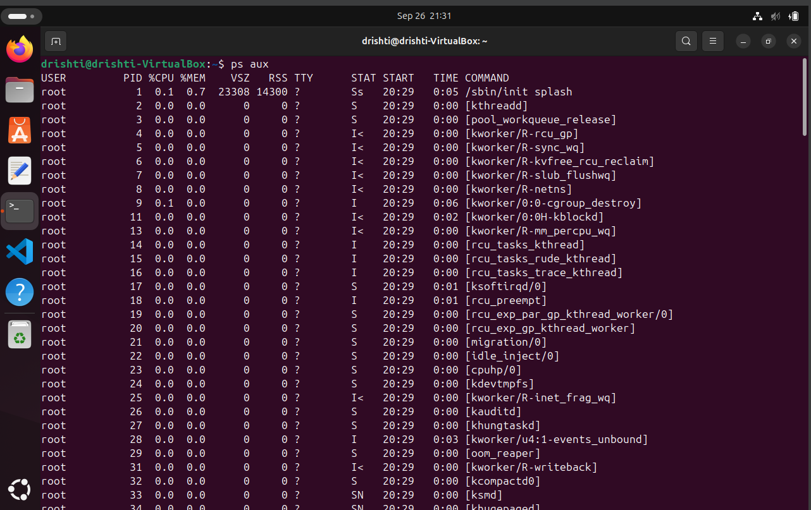

# PROCESS TREE

The `pstree -p` command in Linux shows **running processes in a tree format**, displaying **parent-child relationships**, and includes the **Process IDs (PIDs)**.

---

### 🧾 Syntax:

```bash
pstree -p
```

### OUTPUT

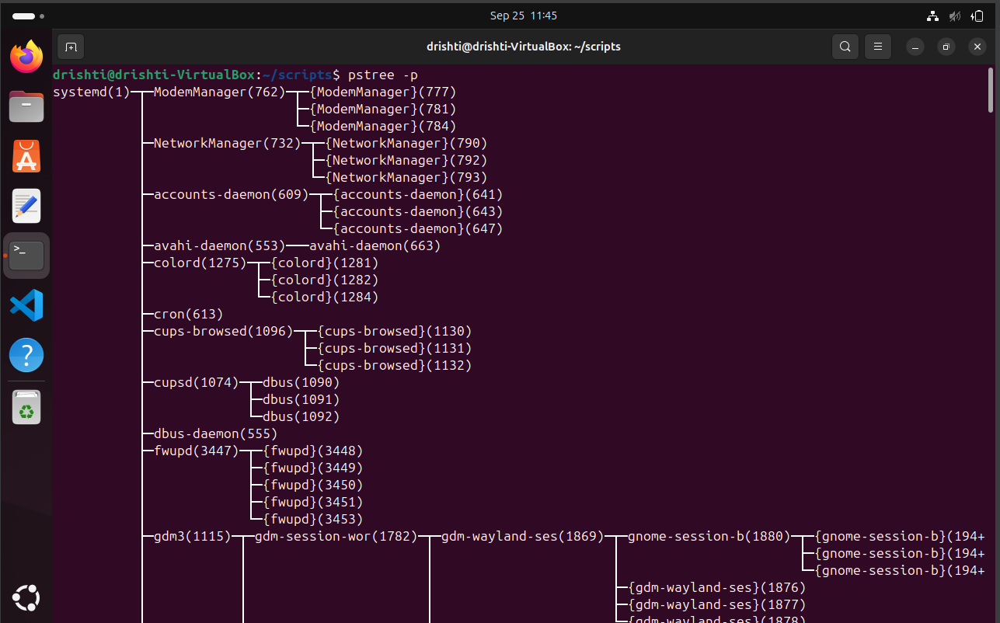

### 📘 What It Does:

* `pstree`: Displays processes as a tree.
* `-p`: Shows the **PID** of each process alongside the name.

---


### ✅ Why Use `pstree -p`?

* See **hierarchical structure** of processes.
* Identify which process **spawned which** (e.g., for debugging).
* Understand **zombie or orphan processes** by looking at parent-child relationships.
* Helps track how **services** or **scripts** spawn child processes.

---

### 🔧 More Useful Options:

* `pstree -p <PID>` — Show the subtree **starting from a specific PID**.
* `pstree -u` — Also show the **user** who owns each process.
* `pstree -a` — Show **command-line arguments** for each process.
* `pstree -c` — Do **not collapse identical subtrees**.


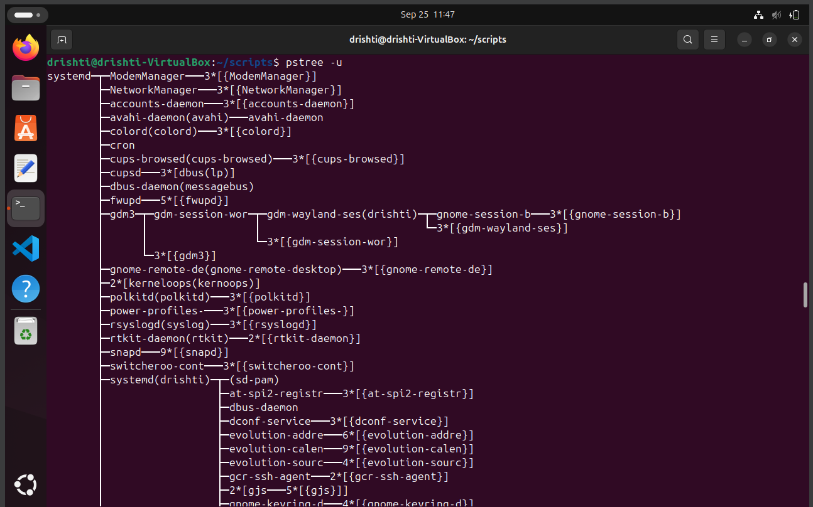
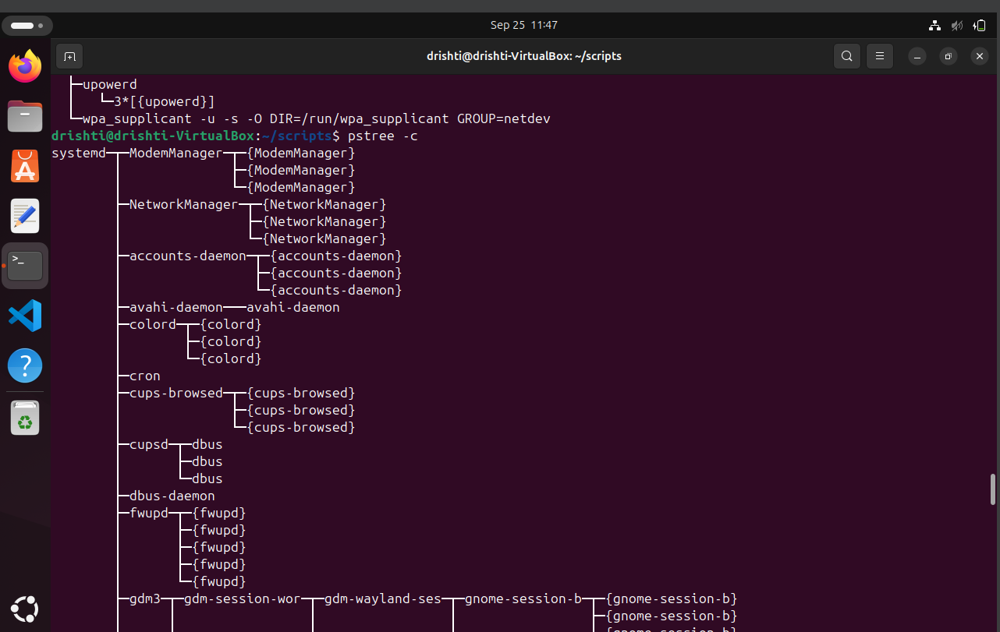
---

# REAL TIME MONITORING:
The `top` command in Linux is a **real-time, dynamic system monitoring tool**. It provides a live, continuously updated view of:

* **Processes** running on the system
* **CPU and memory usage**
* **Load average**
* **System uptime**
* **Resource usage by user/process**

---

### 🧾 Basic Usage:

```bash
top
```

This opens a full-screen terminal interface that updates every few seconds.

---

## OUTPUT

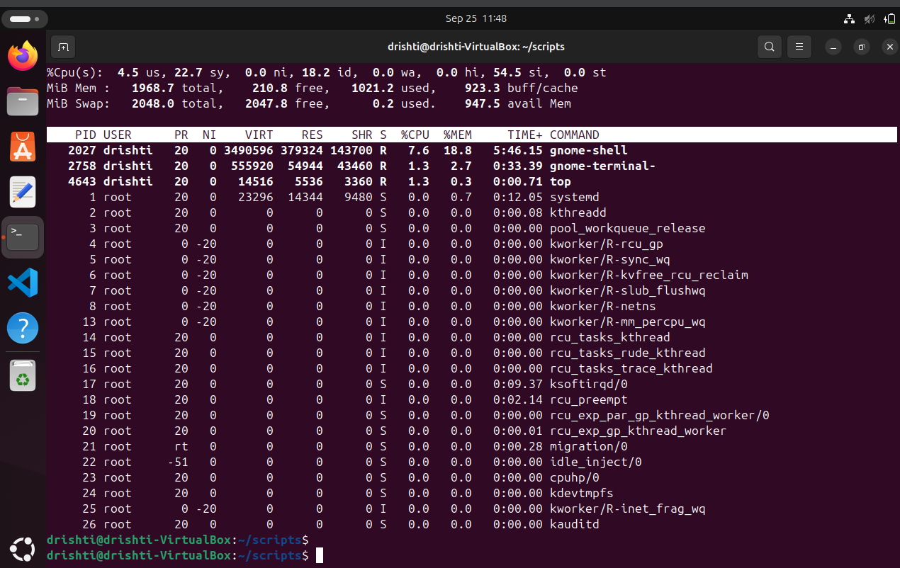

### 📌 Key Sections Explained:

* **Header (first few lines)**:

  * Uptime, load average, user sessions.
  * CPU usage breakdown (`us` = user, `sy` = system, `id` = idle, etc.).
  * Memory and swap usage.

* **Process List**:

  | Column    | Description                                         |
  | --------- | --------------------------------------------------- |
  | `PID`     | Process ID                                          |
  | `USER`    | Process owner                                       |
  | `PR`      | Priority                                            |
  | `NI`      | Nice value                                          |
  | `VIRT`    | Virtual memory used                                 |
  | `RES`     | Resident memory (RAM) used                          |
  | `SHR`     | Shared memory                                       |
  | `S`       | Process state (e.g., `S` = sleeping, `R` = running) |
  | `%CPU`    | CPU usage                                           |
  | `%MEM`    | Memory usage                                        |
  | `TIME+`   | Total CPU time used                                 |
  | `COMMAND` | Command that launched the process                   |

---

### ⌨️ Interactive Commands Inside `top`

While `top` is running, you can interact with it:

* `q` – Quit
* `P` – Sort by **CPU usage**
* `M` – Sort by **memory usage**
* `T` – Sort by **runtime**
* `k` – **Kill** a process (you’ll be prompted for PID)
* `r` – **Renice** a process
* `u` – Show processes for a specific **user**
* `1` – Show CPU usage **per core**

---

---

# ADJUST PROCESS PRIORITY:
In Linux, **adjusting process priority** means changing its **"nice" value**, which affects how much CPU time it gets relative to other processes.

There are two main ways to do this:

---

## 🔼 1. **Start a Process with a Priority** — using `nice`

```bash
nice -n 10 sleep 300 &
```

* Priority range: `-20` (highest priority) to `19` (lowest).
* Default is `0`.
* Only **root** can use negative (high) priorities.

---

## 🔁 2. **Change Priority of an Existing Process** — using `renice`

```bash
renice -n -5 -p 4646
```


* Again, only **root** can set negative nice values.
* Use `top` or `ps aux` to find the PID of the process first.

---

### OUTPUT:

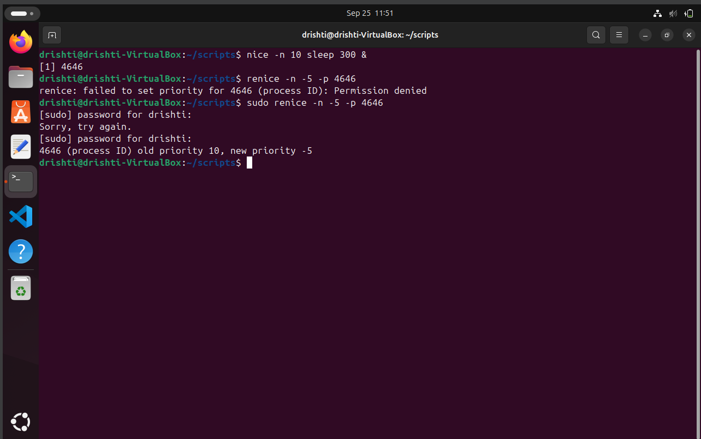

### 📌 Notes:

* A **lower nice value = higher priority**.
* A **higher nice value = lower priority**.
* The **default nice value** is usually `0`.
* **Nice value ≠ real-time scheduling**. For real-time control, use `chrt`, but that's more advanced and rarely needed outside of specific workloads.

---

### ✅ Check Priority:

# CPU AFFINITY (BIND PROCESS TO CPU CORE) :

Binding a process to a specific CPU core(s) in Linux is called setting its **CPU affinity**. This can help with performance tuning, load balancing, or isolating processes.

---

## 🧠 What is CPU Affinity?

**CPU affinity** defines the set of CPU cores on which a process is allowed to run. By default, processes can run on any core, but you can restrict them to specific cores using:

* `taskset` (command-line tool)

---

## 🛠️ **Using `taskset`**

# INPUT:

```bash
taskset -cp 4646
```

---

## ⚙️ Core Numbering

CPU cores are zero-indexed:

| Core  | Number      |
| ----- | ----------- |
| CPU 0 | First core  |
| CPU 1 | Second core |
| ...   | ...         |

Use `lscpu` or `nproc` to check the number of cores available.

---

## OUTPUT:

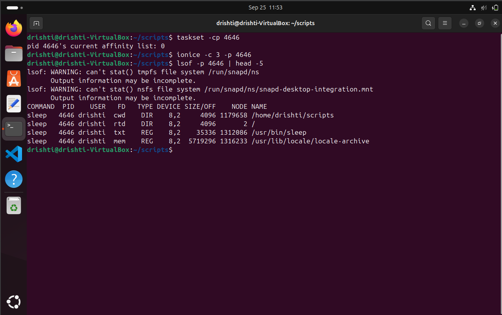


# I/O SCHEDULING PRIORITY :

### 🧾 I/O Scheduling Priority in Linux

In Linux, **I/O priority** controls how the kernel schedules disk I/O for processes, just like **CPU priority** controls CPU time. It can be especially useful when you want to:

* Prioritize a database or service that needs fast disk access.
* Throttle background tasks (like backups) to avoid slowing down the system.

---

## 🛠️ Tool Used: `ionice`

### Basic syntax:

```bash
ionice -c <class> -n <priority> -p <PID>
```

# INPUT:
```
bash
ionice -c 3 -p 4646
```
---

## 🎛️ I/O Priority Classes

There are **three scheduling classes**:

| Class                     | Code | Description                                                 |
| ------------------------- | ---- | ----------------------------------------------------------- |
| **Idle**                  | `3`  | Process only gets I/O when no one else needs it.            |
| **Best Effort** (default) | `2`  | Normal I/O scheduling. Can assign priority levels (`0–7`).  |
| **Real Time**             | `1`  | Highest priority — used with care. Can hog disk. Root only. |

> 🎯 **Lower numbers = higher priority** (just like `nice` values)

---

# FILE DESCRIPTION USED BY A PROCESS :

To view **file descriptors (FDs)** used by a process in Linux, you're essentially asking:
🔍 *"What files, sockets, pipes, etc., is this process using?"*

Every open file, socket, pipe, etc., is assigned a **file descriptor** by the kernel (numbered `0`, `1`, `2`, etc.).

---

## 🔧 View File Descriptors for a Process

### 1. **List Open File Descriptors**

```bash
ls -l /proc/<PID>/fd
```

### Example:

```bash
ls -l /proc/1234/fd
```

This shows all open FDs for process `1234`, like:

```
lrwx------ 1 user user 64 Sep 25 10:30 0 -> /dev/pts/0
lrwx------ 1 user user 64 Sep 25 10:30 1 -> /dev/pts/0
lrwx------ 1 user user 64 Sep 25 10:30 2 -> /dev/pts/0
lr-x------ 1 user user 64 Sep 25 10:30 3 -> /var/log/syslog
```

* `0` = stdin
* `1` = stdout
* `2` = stderr
* Higher numbers are additional FDs: files, sockets, pipes, etc.

---

### 2. **Use `lsof` (List Open Files)**

```bash
lsof -p <PID>
```


---

# OUTPUT:
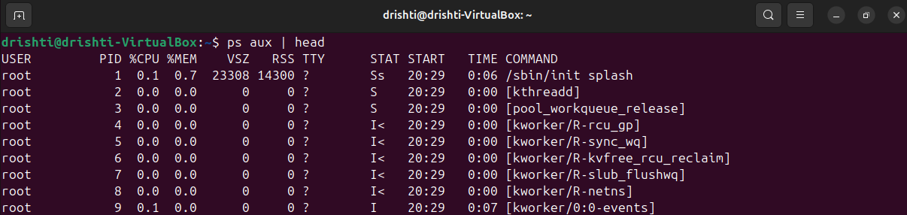

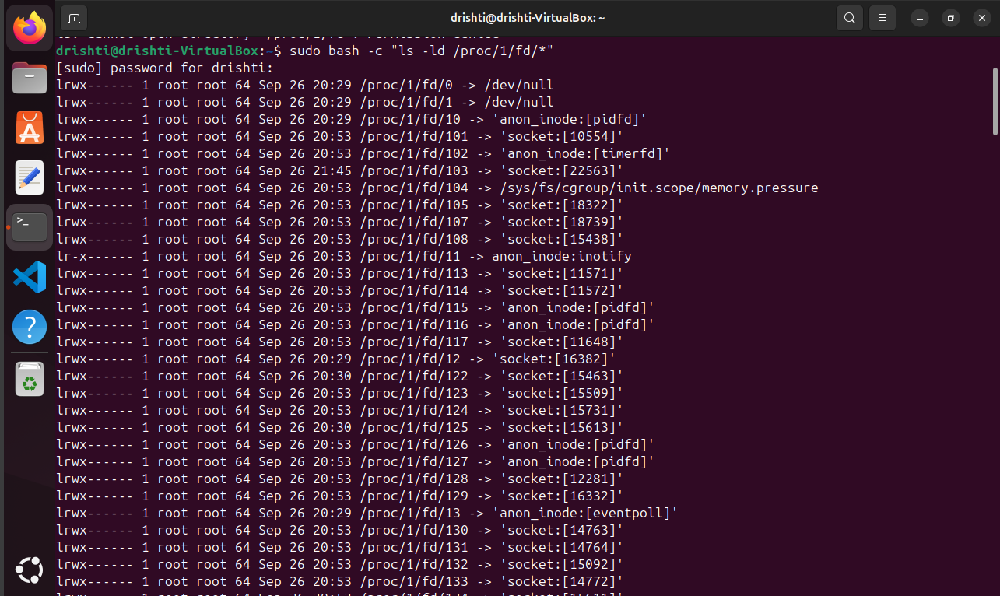


### 3. **Count the Number of Open FDs**

```bash
ls /proc/<PID>/fd | wc -l
```
# OUTPUT:

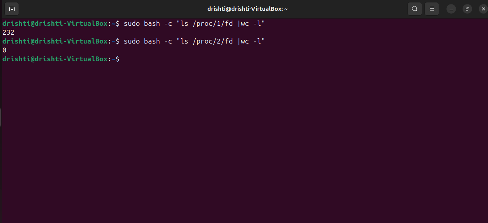

---

# TRACE SYSTEM CALLS OF A PROCESS :
To **trace system calls** made by a process in Linux, you typically use the `strace` command. It shows every **syscall** (like `open()`, `read()`, `write()`, `execve()`, etc.) that a process makes — very useful for debugging, troubleshooting, and understanding how programs interact with the kernel.

---

## 🔧 1. **Trace a New Process**

```bash
strace <command>
``` x

---

## 🔍 2. **Attach to an Existing Process**

```bash
sudo strace -p 4646
```

# OUTPUT:

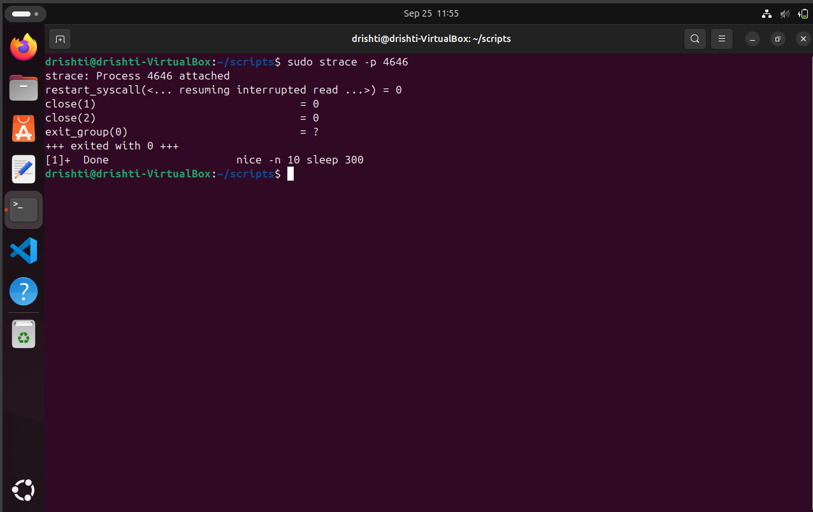


# FIND PROCESS USING A PORT :

To find **which process is using a specific port** in Linux (e.g., `port 8080`), you can use a few common tools like `lsof`, `ss`, or `netstat`.

---

## ✅ 1. **Using `lsof` (most direct)**

```bash
sudo lsof -i :<port>
```


## 🧪 Bonus: Find All Listening Ports

```bash
sudo lsof -i -P -n | grep LISTEN
```
# EXAMPLE:

lsof -p 4646 | head -5

# OUTPUT:

---

## 🧾 1. **Use `ps` for Basic Stats**

```bash
ps -p <PID> -o pid,ppid,%cpu,%mem,vsz,rss,tty,stat,time,cmd
```

### Example:

```bash
ps -p 1 -o pid,%cpu,%mem,vsz,rss,time,cmd
ps -p 2 -o pid,%cpu,%mem,vsz,rss,time,cmd
ps -p 5 -o pid,%cpu,%mem,vsz,rss,time,cmd
```

| Field  | Description               |
| ------ | ------------------------- |
| `%CPU` | CPU usage                 |
| `%MEM` | Memory usage              |
| `VSZ`  | Virtual memory used (KB)  |
| `RSS`  | Resident memory used (KB) |
| `TIME` | Total CPU time            |
| `CMD`  | Command                   |

---
# OUTPUT:

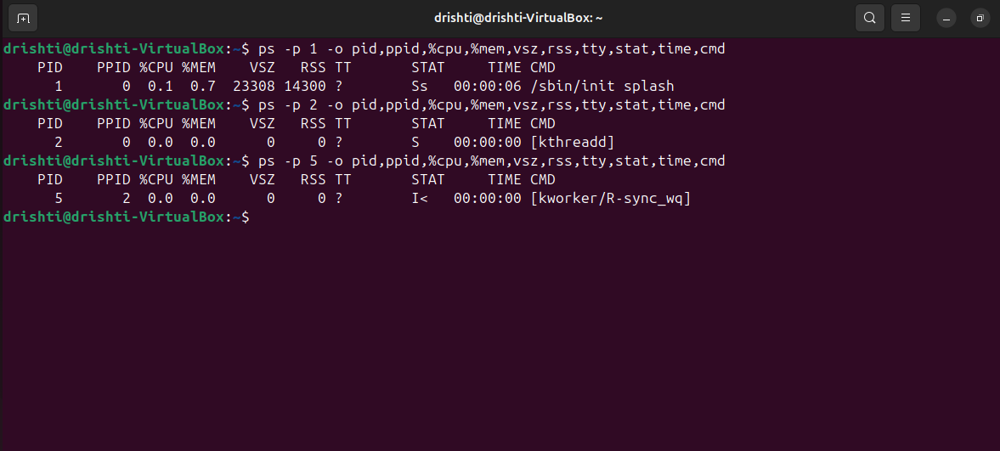

## 📦 5. **Use `pidstat` (from `sysstat` package)**

```bash
pidstat -p <PID> 1
```

# OUTPUT:

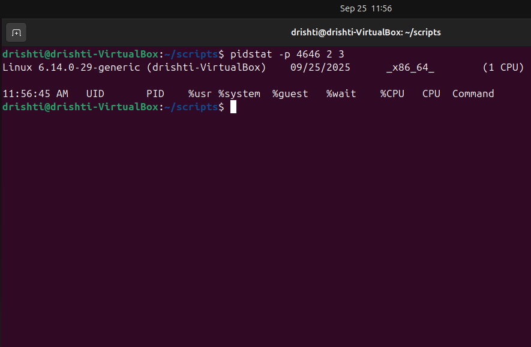

Shows real-time CPU, memory, and I/O stats for a process every second.

# SUMMARIZED FORM :


| Command / File                                      | Purpose                                    | Basic Usage                                    | What It Shows                                       | Notes                                  |                                              |
| --------------------------------------------------- | ------------------------------------------ | ---------------------------------------------- | --------------------------------------------------- | -------------------------------------- | -------------------------------------------- |
| 📝 **`ps aux`**                                     | List all running processes                 | `ps aux`                                       | All processes with CPU, memory, user, PID, command  | Good snapshot of system activity       |                                              |
| 🌳 **`pstree -p`**                                  | Show process tree with PIDs                | `pstree -p`                                    | Processes organized by parent-child hierarchy       | See how processes relate to each other |                                              |
| ⚡ **`top`**                                         | Live system/process monitoring             | `top`                                          | CPU, memory, load, processes sorted by usage        | Interactive, press `q` to quit         |                                              |
| 🔧 **Adjust Priority (nice/renice)**                | Change CPU scheduling priority             | `nice -n 10 cmd` or `renice 5 -p PID`          | Process CPU priority (lower nice = higher priority) | Root needed for negative priorities    |                                              |
| 🎯 **CPU Affinity (taskset)**                       | Bind process to specific CPU cores         | `taskset -c 0,2 cmd` or `taskset -cp 1 PID`    | Restrict process to certain cores                   | Useful for performance tuning          |                                              |
| 📂 **I/O Scheduling Priority (ionice)**             | Control disk I/O priority                  | `ionice -c 2 -n 7 cmd` or `ionice -c 3 -p PID` | I/O priority classes & levels                       | Depends on I/O scheduler               |                                              |
| 📁 **File Descriptors**                             | See open files/sockets of a process        | `ls -l /proc/PID/fd` or `lsof -p PID`          | Open files, sockets, pipes with FD numbers          | Check resource leaks or usage          |                                              |
| 🛠️ **Trace Syscalls (strace)**                     | Trace system calls by a process            | `strace cmd` or `strace -p PID`                | Kernel syscalls made by the process                 | Great for debugging                    |                                              |
| 🔌 **Find Process Using a Port**                    | Identify which process uses a network port | `sudo lsof -i :PORT` or `sudo ss -tulnp        | grep :PORT`                                         | Shows PID & command using the port     | Useful for troubleshooting network conflicts |
| 📊 **Per-Process Stats (ps, /proc, pidstat, etc.)** | Detailed resource usage per process        | `ps -p PID -o ...`, `cat /proc/PID/status`     | CPU, memory, threads, I/O, context switches         | Combine tools for full insight         |                                              |

---
