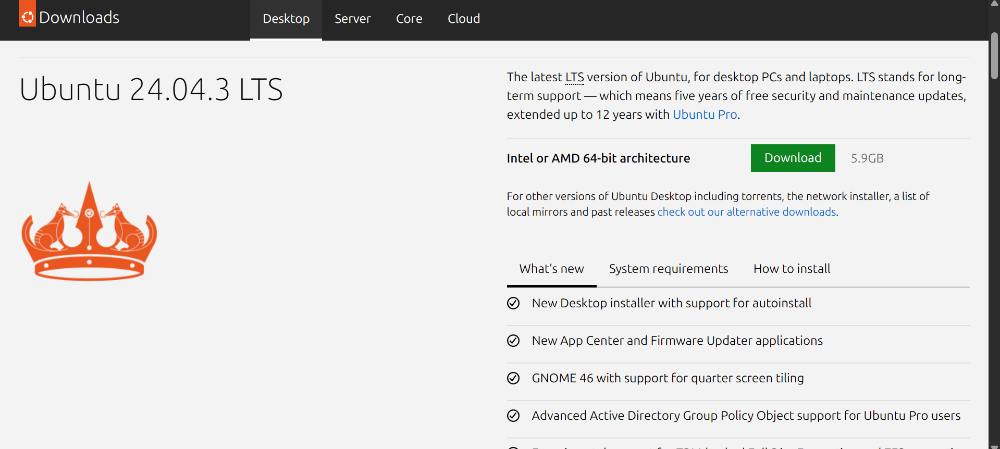
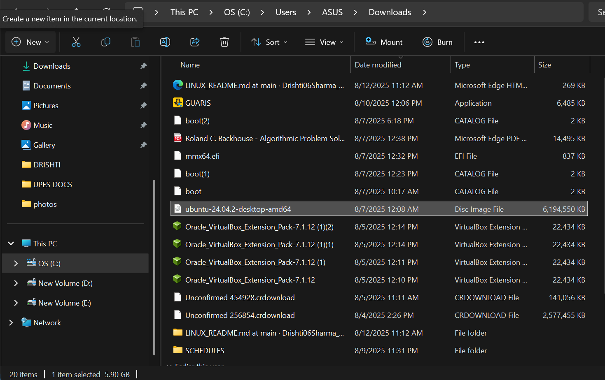
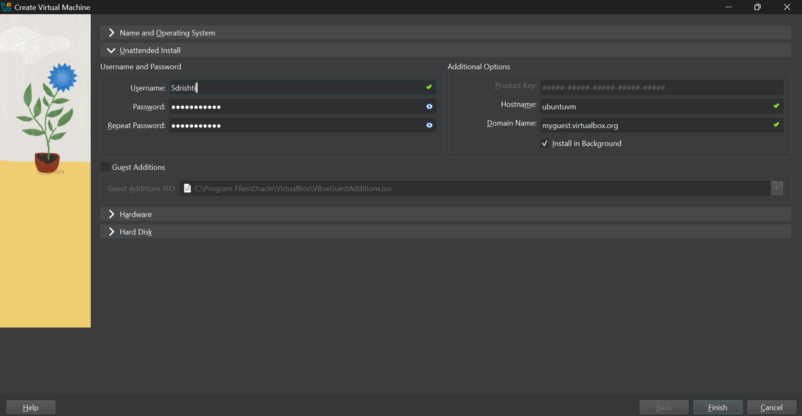
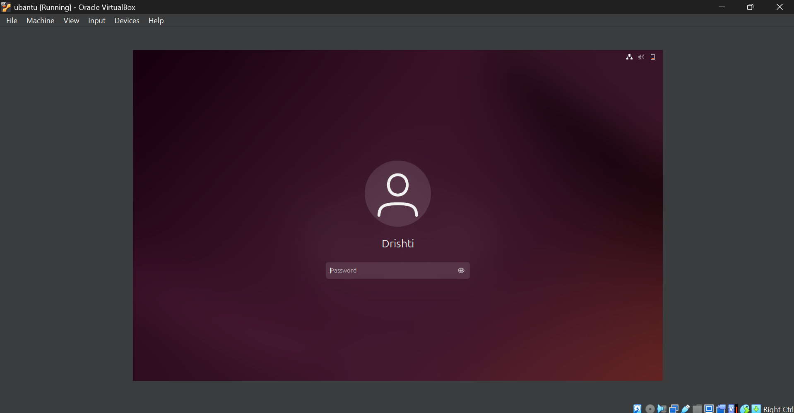
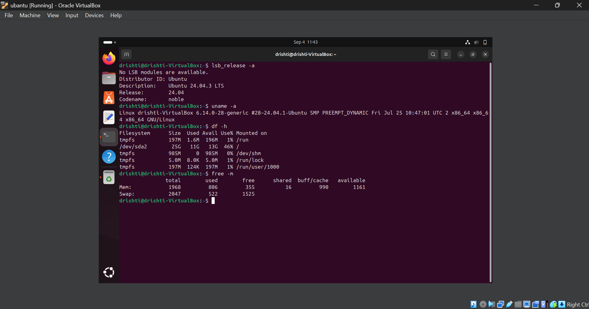

✌𝓞𝓑𝓙𝓔𝓒𝓣𝓘𝓥𝓔✌

# Installing Ubuntu on VirtualBox

---

## 1. Install VirtualBox

⩥ Go to the [VirtualBox official website](https://www.virtualbox.org/).  
⩥ Download the installer for your operating system (Windows, macOS, Linux).  
⩥ Run the installer and follow the on-screen instructions.  
⩥ Once installed, launch VirtualBox.

### PICTORIAL REPRESENTATION 📷

---

## 2. Download Ubuntu ISO

🪄 Go to the [Ubuntu official download page](https://ubuntu.com/download/desktop).  
🪄 Download the **latest LTS (Long Term Support)** version.  
🪄 Save the ISO file to a known location on your computer.

### PICTORIAL REPRESENTATION 📷

🪄 locate the ISO image in your computer.

(OS(C)/users/ASUS/Downloads)

### PICTORIAL REPRESENTATION 📷

---

## 3. Create a New Virtual Machine

→ Open VirtualBox and click **New**.  
→  Enter a **Name** for your VM (e.g., `UbuntuVM`).  
→  Set **Type** to `Linux` and **Version** to `Ubuntu (64-bit)`.    

### PICTORIAL REPRESENTATION 📷

→  Set **username** , **password** .

### PICTORIAL REPRESENTATION 📷

**Memory Size**:  
⪼ Allocate at least **2048 MB (2 GB)** of RAM.  

### PICTORIAL REPRESENTATION 📷

**Hard Disk**:  
⪼ Choose **Create a virtual hard disk now**.  .  
⪼ Select **VDI (VirtualBox Disk Image)**.  
⪼ Choose **Dynamically allocated**.  
⪼ Set the **disk size** to at least **20 GB**.  
⪼ Click **Finish**.

### PICTORIAL REPRESENTATION 📷

---

## 4. Install Ubuntu in the VM

=> Select your VM and click **Start**.  
=> When prompted for a start-up disk, browse and select the Ubuntu ISO you downloaded.  
=> Click **Start**.  
=> The Ubuntu installer will load. Follow these steps:  
   - Select **Install Ubuntu**.  
   - Choose your **keyboard layout**.  
   - Select **Normal installation**.  
   - Enable **Download updates while installing Ubuntu** (optional).  
   - Click **Install Now**.  
   - Confirm **disk changes** and click **Continue**.  
   - Choose your **time zone**.  
   - Create a **user account** (username and password).  
=> Wait for the installation to complete, then restart the VM.  
=> Remove the ISO when prompted, and Ubuntu will boot from the virtual hard disk.

### PICTORIAL REPRESENTATION 📷

---

### A SHORT REFLECTION 😌

🧐 WHAT CHALLENGES DID YOU FACE DURING INSTALLATION?

1️⃣ At first glance wasn't able to figure out where the iso image was installed.

2️⃣ Secondly network issue for sure.

3️⃣ Thirdly faced problem in setting up things in the backend of ubuntu ...But with some time achieved success by learing and finding out where the things were getting wrong..

---

⁉️ ADDITIONAL QUESTIONS

🤔 WHAT ARE TWO ADVANTAGES OF INSTALLING UBUNTU IN VIRTUAL BOX?

1️⃣ ISOLATION AND SAFETY:

VirtualBox creates a virtual machine through which we can test software , configurations and even researche malware without affecting our main OS.

2️⃣ NO REBOOTING:

We donot need to reboot our computer to swtich between our host OS and ubuntu .

🤔 WHAT ARE TWO ADVANTAGES OF DUAL BOOTING INSTEAD OF USING A VM?

👉 SUPERIOR PERFORMANCE:
 In dual boot , we can run only one OS at a time which provides it a complete access to the computer's hardware , including CPU , GPU , RAM . While in vm it works on top of another operating system , which can lead to performance degradation.

👉 FULL HARDWARE CAPABILITIES AND FUNCTIONALITY:
 Some applications require full unimpeded power of our hardware . Dual booting provides this native environment ensuring that our chosen OS can utilize all our computer's capabilities without limitations .

