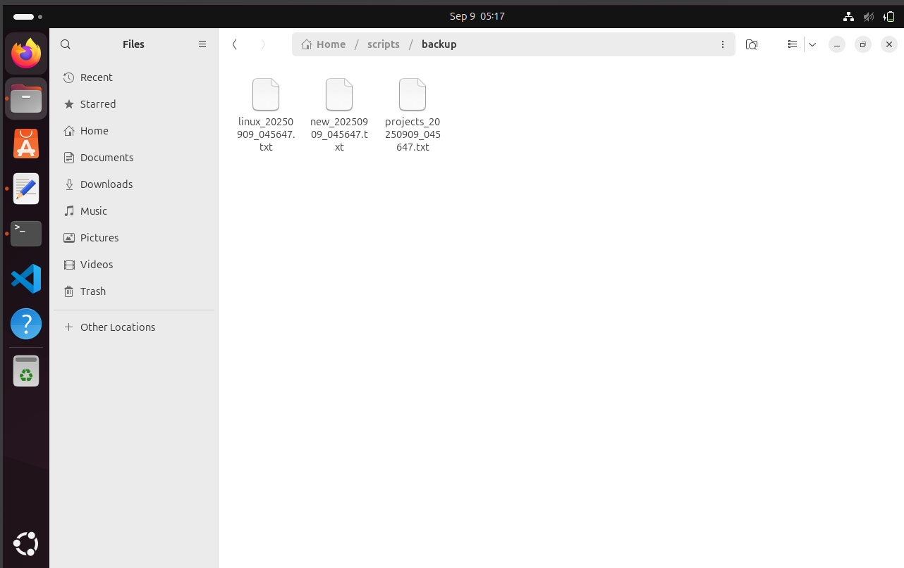

# 📦 Backup Script — How It Works & Handy Tips! 🚀

---

## What Does This Script Do? 🤔

This handy little script:

- **Searches for all `.txt` files** in the folder where you run it  
- **Copies** each `.txt` file into a special folder named `backup/`  
- Adds a **timestamp** (date and time) to the backup filename so you get unique copies every time — no overwriting!

---

## 🔑 Where Should You Run the Script?

The script only looks for `.txt` files in the **current working directory** — that means **where you run it from**.  

**Typical folder setup:**


> **Important:**  
> If you run the script *inside* the `backup/` folder, it won’t find any `.txt` files to back up — because your original `.txt` files are *outside* of that folder.

---

## What Happens When You Run It? 🎉

Run:

```bash
./backup.sh
```

You’ll see lines like this in your terminal:


Backed up linux.txt     -> backup/linux_20250909_045647.txt
Backed up new.txt       -> backup/new_20250909_045647.txt
Backed up projects.txt  -> backup/projects+20250909_045647.txt

### VISUALS:


Inside the `backup/` folder, you’ll find timestamped copies of your original `.txt` files, safe and sound! 🕒✨

### VISUALS:



---

## What If There Are No `.txt` Files? 😶

If no `.txt` files are found in the current folder, the script quietly does nothing — no backups, no messages.


## Quick Troubleshooting Guide âš™ï¸

| Problem                       | Why?                               | How to Fix   |
| No output when running script | Script run inside `backup/` folder | Run script in folder with `.txt` files(usually the parent folder) |
| Permission denied             | Script lacks execute permissions   | Run `chmod +x backup.sh` to make it executable                      |
| No `.txt` files found         | No `.txt` files in current folder  | Create some `.txt` files or double-check your location                   |

---

## Summary 🎯

* Keep your `backup.sh` script **in the same folder as your `.txt` files**, **not inside `backup/`**.
* Run the script from that folder — it will create a `backup/` folder for the copies.
* The script backs up `.txt` files by adding timestamps to prevent overwriting.
* If you want the script to tell you when no `.txt` files are found, add the notification snippet.

---

💬 **Questions? 


🤔 WHAT IS THE DIFFRENCE BETWEEN cp, mv, AND rsync?

Absolutely! Here’s a super concise and cleanly formatted version:

---

### Difference Between `cp`, `mv`, and `rsync`

| Command | Function    | 
| ------- | ----------- | 
| `cp`    | Copy files  |
| `mv`    | Move/Rename | 
| `rsync` | Sync files  | 

---

* **`cp`**: duplicates files, originals stay intact
* **`mv`**: moves or renames files, originals removed
* **`rsync`**: efficiently syncs files locally or remotely, transfers only changes

---

🤔 HOW CAN YOU SCHEDULE SCRIPTS TO RUN AUTOMATICALLY?

# â° Ubuntu Script Scheduler (via `cron`)

### 🧩 Edit Crontab:
```bash
crontab -e
```


### 🕒 Add Job (runs at 2:00 AM):

```
0 2 * * * /home/drishti/scripts/backup.sh
```
### ✅ Make Script Executable:
```bash
chmod 777 /home/drishti/scripts/backup.sh
```
### 👀 View Jobs:
```bash
crontab -l
```
🧠 **Use full paths** & redirect output if needed:
0 2 * * * /home/drishti/scripts/backup.sh >> /home/drishti/scripts/backup.log 2>&1


