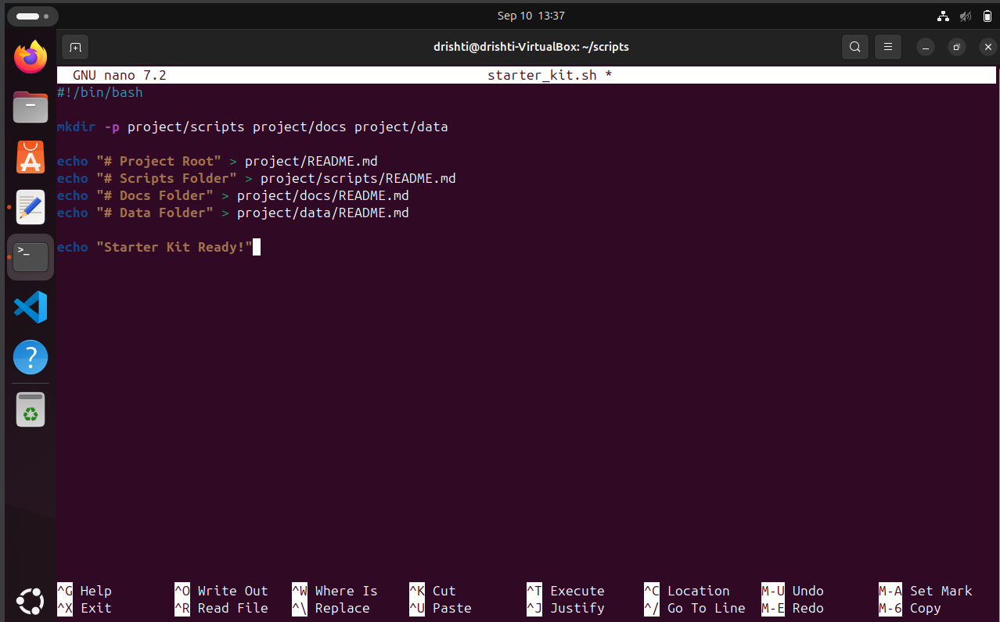

✌𝓞𝓑𝓙𝓔𝓒𝓣𝓘𝓥𝓔✌

# 🚀 Purpose of `starter_kit.sh` Script

The `starter_kit.sh` script is your **go-to quick starter** for creating a clean and organized project environment! 🎉

---

## What does it do? 🛠️

- **Creates a well-structured folder hierarchy** to kickstart any project:

```

project/
⩥  scripts/   📝 # Place your code and scripts here
⩥  docs/      📚 # Store documentation, guides, and manuals here
⩥  data/      📊 # Keep your datasets and raw data here

```


### VISUAL REPRESENTATION:




- **Adds placeholder `README.md` files** in every folder with a simple description, so anyone who visits the project instantly knows the purpose of each directory. 📄✨

---

## Why is this important? 🤔

- Keeps your project **organized and consistent**, which is essential for collaboration and future maintenance.
- Makes it easier to **onboard new team members** or contributors, as the structure and documentation are ready.
- Saves you from **repetitive manual setup**, letting you focus on what matters — **building awesome projects!** 💻💡

---

## How does it feel? 🎉

Imagine hitting **one command** and getting your project folders ready — it’s like magic! ✨

---

## Final message

When the setup finishes, you’ll see:

```

Starter Kit Ready!

```

💬 **Questions? 


🤔 WHAT DOES mkdir -p DO?

👉  That’s where mkdir -p comes in — it’s like your magical builder 🧙‍♂️ who:
     Builds all the missing parts (parent folders) step-by-step 🛠️.
     Doesn’t complain if your house (folder) already exists 🏠✅.


🤔 WHY IS AUTOMATION USEFUL IN DevOps?

👉 Speed 🚀
Automation speeds up repetitive tasks like building, testing, and deploying apps — so you can deliver features faster than ever! ⏩

👉 Consistency 🎯
Automated processes run the same way every time, reducing human errors and making your systems more reliable. 🛡️✅

👉 Scalability 🌍
Need to deploy your app on 10 servers or 10,000? Automation handles it without breaking a sweat! 💪📈
