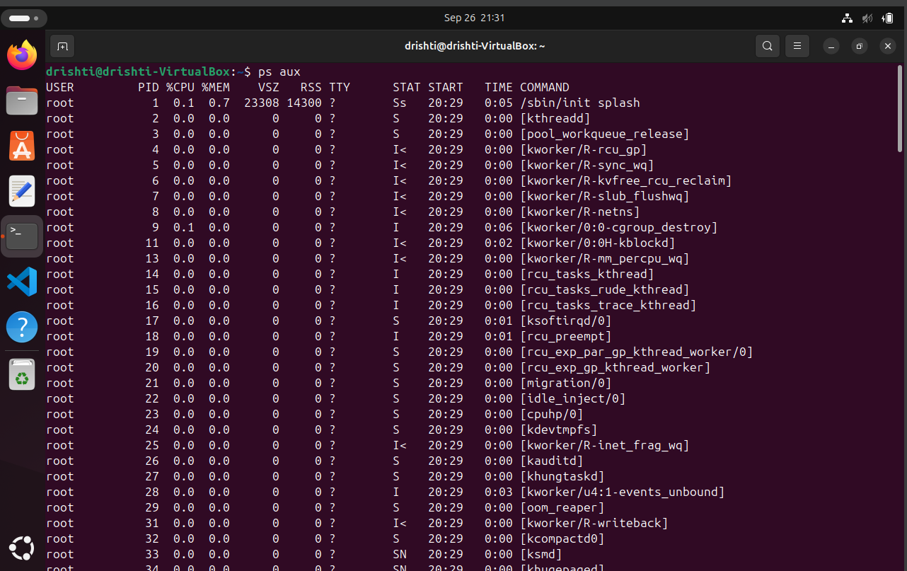
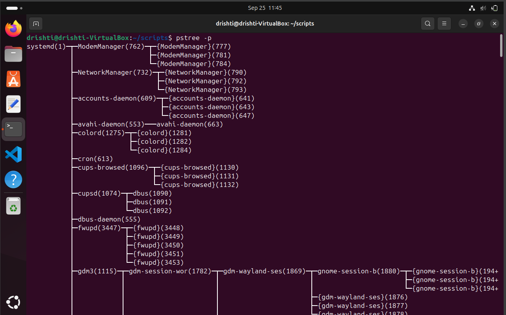
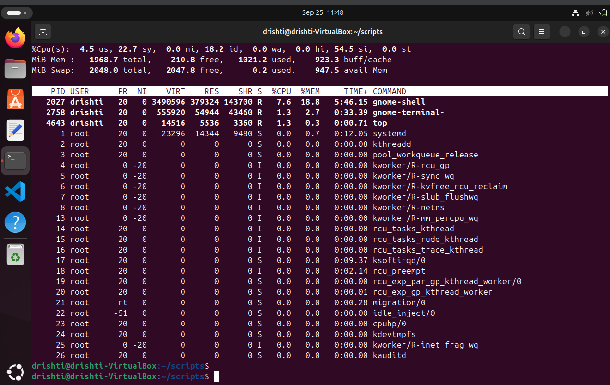
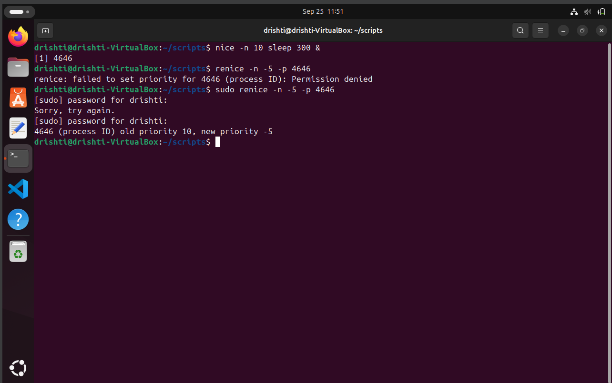
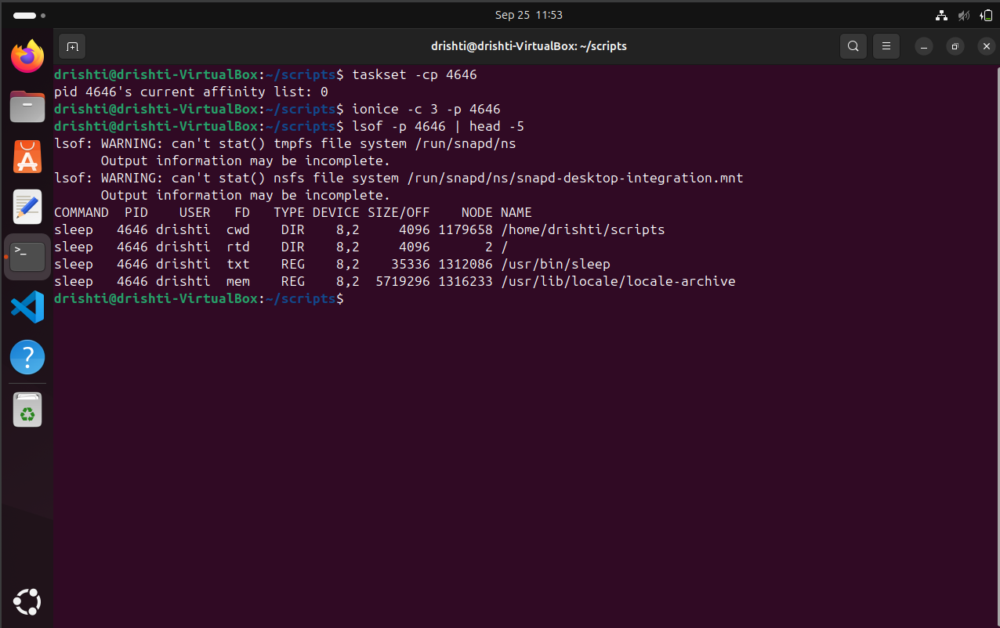
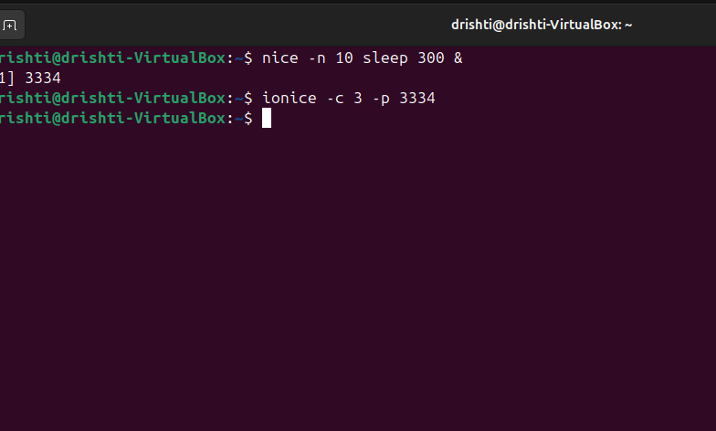
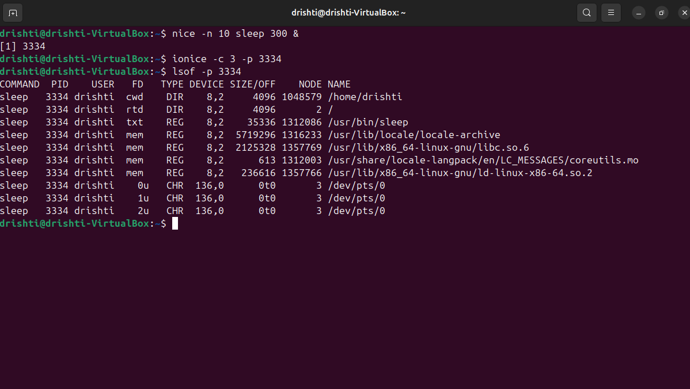
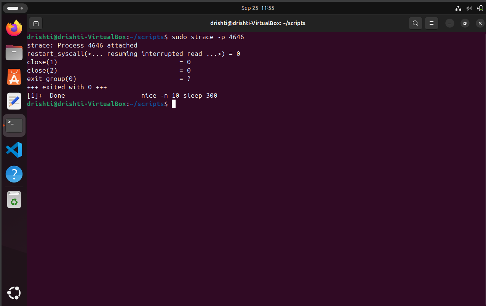
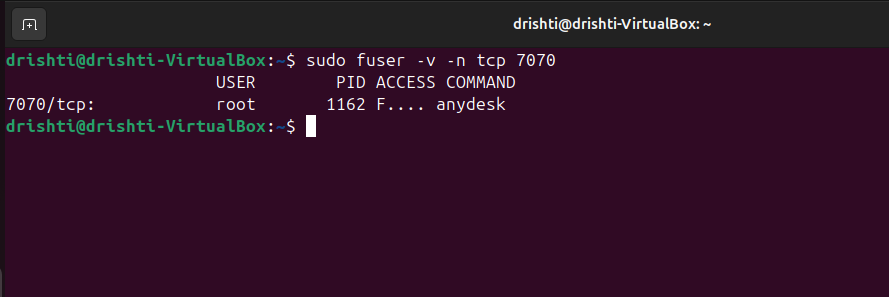
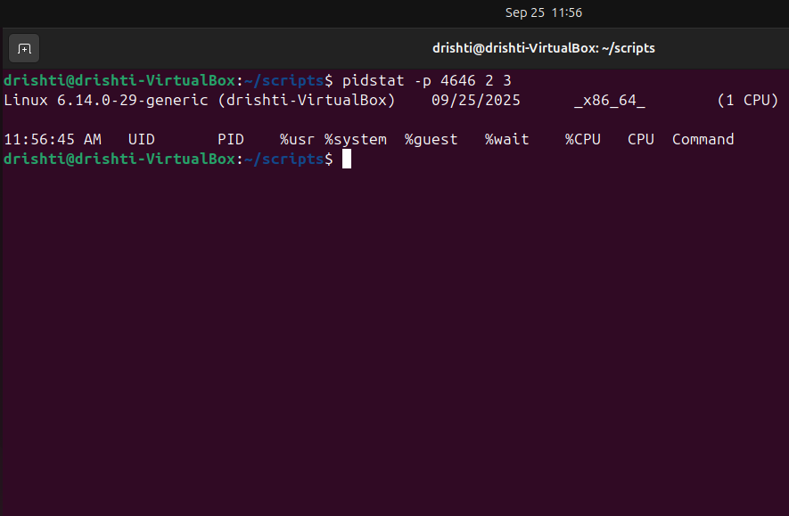

### ADVANCE COMMANDS OF LINUX :

# 1. PS - AUX
The `ps aux` command in Linux is used to **display information about all running processes** on the system. It's a combination of options passed to the `ps` (process status) command.

--- sc

### 🔧 Command Breakdown: `ps aux`

* **`ps`** – The base command to report a snapshot of current processes.
* **`a`** – Show processes for **all users**, not just the current user.
* **`u`** – Display the process's user/owner and **show in a user-oriented format** (includes user, CPU %, memory %, etc.).
* **`x`** – Include processes that are **not attached to a terminal** (like daemons or background services).

---

### 🧾 Typical Output Fields from `ps aux`

| Column    | Description                              |
| --------- | ---------------------------------------- |
| `USER`    | Owner of the process                     |
| `PID`     | Process ID                               |
| `%CPU`    | CPU usage percentage                     |
| `%MEM`    | Memory usage percentage                  |
| `VSZ`     | Virtual memory size (in KB)              |
| `RSS`     | Resident Set Size (physical memory used) |
| `TTY`     | Terminal associated with the process     |
| `STAT`    | Process state (e.g., R, S, Z, T, etc.)   |
| `START`   | Start time of the process                |
| `TIME`    | Total CPU time used by the process       |
| `COMMAND` | The command with all its arguments       |

---

### PICTORIAL REPRESNENTATION:



# 2. PROCESS TREE

The `pstree -p` command in Linux shows **running processes in a tree format**, displaying **parent-child relationships**, and includes the **Process IDs (PIDs)**.

---

### 🧾 Syntax:

```bash
pstree -p
```

### OUTPUT



### 📘 What It Does:

* `pstree`: Displays processes as a tree.
* `-p`: Shows the **PID** of each process alongside the name.

---


### ✅ Why Use `pstree -p`?

* See **hierarchical structure** of processes.
* Identify which process **spawned which** (e.g., for debugging).
* Understand **zombie or orphan processes** by looking at parent-child relationships.
* Helps track how **services** or **scripts** spawn child processes.

---

# 3. REAL TIME MONITORING:
The `top` command in Linux is a **real-time, dynamic system monitoring tool**. It provides a live, continuously updated view of:

* **Processes** running on the system
* **CPU and memory usage**
* **Load average**
* **System uptime**
* **Resource usage by user/process**

---

### 🧾 Basic Usage:

```bash
top
```

This opens a full-screen terminal interface that updates every few seconds.

---

## OUTPUT



### 📌 Key Sections Explained:

* **Header (first few lines)**:

  * Uptime, load average, user sessions.
  * CPU usage breakdown (`us` = user, `sy` = system, `id` = idle, etc.).
  * Memory and swap usage.

* **Process List**:

  | Column    | Description                                         |
  | --------- | --------------------------------------------------- |
  | `PID`     | Process ID                                          |
  | `USER`    | Process owner                                       |
  | `PR`      | Priority                                            |
  | `NI`      | Nice value                                          |
  | `VIRT`    | Virtual memory used                                 |
  | `RES`     | Resident memory (RAM) used                          |
  | `SHR`     | Shared memory                                       |
  | `S`       | Process state (e.g., `S` = sleeping, `R` = running) |
  | `%CPU`    | CPU usage                                           |
  | `%MEM`    | Memory usage                                        |
  | `TIME+`   | Total CPU time used                                 |
  | `COMMAND` | Command that launched the process                   |

---

### ⌨️ Interactive Commands Inside `top`

While `top` is running, you can interact with it:

* `q` – Quit
* `P` – Sort by **CPU usage**
* `M` – Sort by **memory usage**
* `T` – Sort by **runtime**
* `k` – **Kill** a process (you’ll be prompted for PID)
* `r` – **Renice** a process
* `u` – Show processes for a specific **user**
* `1` – Show CPU usage **per core**

---

# ADJUST PROCESS PRIORITY:
In Linux, **adjusting process priority** means changing its **"nice" value**, which affects how much CPU time it gets relative to other processes.

There are two main ways to perform this:

---

## 🔼 1. **Start a Process with a Priority** — using `nice`

```bash
nice -n 10 sleep 300 &
```

* Priority range: `-20` (highest priority) to `19` (lowest).
* Default is `0`.
* Only **root** can use negative (high) priorities.

---

## 🔁 2. **Change Priority of an Existing Process** — using `renice`

```bash
renice -n -5 -p 4646
```


* Again, only **root** can set negative nice values.
* We would use  `top` or `ps aux` to find the PID of the process first.

---

### OUTPUT:



### 📌 Notes:

* A **lower nice value = higher priority**.
* A **higher nice value = lower priority**.
* The **default nice value** is usually `0`.

---

### 4. ✅ Check Priority:

# CPU AFFINITY (BIND PROCESS TO CPU CORE) :

Binding up a process to a specific CPU core in Linux is known as setting its **CPU affinity**. This can help with performance tuning, load balancing, as well as isolating processes.

---

## 🧠 What is CPU Affinity?

**CPU affinity** defines the set of CPU cores on which a process is allowed to run. By default, processes can run on any core, but you can restrict them to specific cores using:

* `taskset` (command-line tool)

---

## 🛠️ **Using `taskset`**

# INPUT:

```bash
taskset -cp 4646
```

---
## ⚙️ Core Numbering

CPU cores are zero-indexed:

| Core  | Number      |
| ----- | ----------- |
| CPU 0 | First core  |
| CPU 1 | Second core |
| ...   | ...         |

---

## OUTPUT:




# 5. I/O SCHEDULING PRIORITY :

### 🧾 I/O Scheduling Priority in Linux

In Linux, **I/O priority** controls how the kernel schedules disk I/O for processes, just like **CPU priority** controls CPU time. It can be especially useful when :

* One wants to prioritize a database or service that needs fast disk access.
* When one wants to throttle background tasks (like backups) to avoid slowing down the system.

---

## 🛠️ Tool Used: `ionice`

### Basic syntax:

```bash
ionice -c <class> -n <priority> -p <PID>
```

# INPUT:
```
bash
ionice -c 3 -p 3334
```
# OUTPUT:

---

# 7. FILE DESCRIPTION USED BY A PROCESS :

To view **file descriptors (FDs)** used by a process in Linux, you're essentially asking:
🔍 *"What files, sockets, pipes, etc., is this process using?"*

Every open file, socket, pipe, etc., is assigned a **file descriptor** by the kernel (numbered `0`, `1`, `2`, etc.).

---

## 🔧 View File Descriptors for a Process

**Use `lsof` (List Open Files)**

```bash
lsof -p <PID>
```


---

# OUTPUT:



---

# 8. TRACE SYSTEM CALLS OF A PROCESS :
To **trace system calls** made by a process in Linux, you typically use the `strace` command. It shows every **syscall** (like `open()`, `read()`, `write()`, `execve()`, etc.) that a process makes — very useful for debugging, troubleshooting, and understanding how programs interact with the kernel.

---

## 🔍  **Attach to an Existing Process**

```bash
sudo strace -p 4646
```

# OUTPUT:




# 9. FIND PROCESS USING A PORT :

To find **which process is using a specific port** in Linux (e.g., `port 8080`), you can use a few common tools like `lsof`, `ss`, or `netstat`but we will use `fuser`.

---

# Using fuser -n:

```bash
sudo fuser -n tcp 8080
```
# OUTPUT:



## 📦 10. **Use `pidstat` (from `sysstat` package)**

```bash
pidstat -p <PID> 1
```

# OUTPUT:



Shows real-time CPU, memory, and I/O stats for a process every second.

## 11. **Control groups for resource limits**
```bash
sudo cgcreate -g cpu,memory:/testgroup
```
Add process to cgroup

## OUTPUT:

## 12. 🎯 Alternative ways to use nice / renice

# 🕒 `chrt`  
Set real-time scheduling policy for a process.  
```bash
sudo chrt -f 50 sleep 1000
````

Use when you need FIFO or RR scheduling.

### 💾 `ionice`

Control a process’s I/O priority.

```bash
ionice -c 2 -n 7 tar -czf backup.tar.gz /home
```

Great for background disk-heavy tasks.

### 🎮 `taskset`

Bind a process to specific CPU core(s).

```bash
taskset -c 1 firefox
```

Use for CPU isolation or reducing interference.

### 🧩 `cgroups`

Group resource limits (CPU, memory, I/O) for sets of processes.

```bash
sudo cgcreate -g cpu,memory:/lowprio
echo 20000 | sudo tee /sys/fs/cgroup/cpu/lowprio/cpu.cfs_quota_us
echo 200M   | sudo tee /sys/fs/cgroup/memory/lowprio/memory.limit_in_bytes
echo 1234 | sudo tee /sys/fs/cgroup/cpu/lowprio/cgroup.procs
```

### 🔧 `systemd-run`

Run a command under a transient `systemd` scope with resource controls.

```bash
systemd-run --scope -p CPUWeight=200 stress --cpu 4
```
---

### ✅ At a glance:

* **chrt** → scheduling policy/prio
* **ionice** → I/O priority
* **taskset** → CPU affinity
* **cgroups** → group resource limits
* **systemd-run** → systemd-integrated control

## SUMMARY:

| 🛠️ Command           | ✨ What it does                                                   | 🔍 Quick note                                                     |
| --------------------- | ---------------------------------------------------------------- | ----------------------------------------------------------------- |
| `ps aux`              | Lists **all running processes** (all users, background)          | Great for a full snapshot of active processes                     |
| `pstree -p`           | Shows processes in a **tree structure** with PIDs                | Helps you see parent-child relationships                          |
| `top`                 | Real-time view of processes + CPU/memory/load                    | Ideal for live monitoring of system resource usage                |
| `nice`                | Start a process with a modified CPU priority                     | Lower nice = higher priority                                      |
| `renice`              | Change priority of an existing process                           | Useful when you need to adjust a running process                  |
| `taskset`             | Bind a process to specific CPU core(s)                           | Helpful for performance tuning and isolating workloads            |
| `ionice`              | Set I/O (disk) scheduling priority for a process                 | Useful when disk-heavy tasks need to be throttled or prioritized  |
| `lsof -p <PID>`       | List **open files / sockets** used by a process                  | Good for checking what a process is using (files, network)        |
| `strace -p <PID>`     | Trace system calls of a process                                  | Great for debugging how a process interacts with the kernel       |
| `fuser -n tcp <port>` | Find process using a specific network port                       | Handy when you want to see who’s listening on or using a port     |
| `pidstat`             | Monitor per-process CPU / memory / I/O stats                     | Good for detailed process resource usage analysis ([man7.org][1]) |
| `cgcreate / cgroups`  | Create & assign processes to a control-group for resource limits | For advanced resource control across processes                    |

