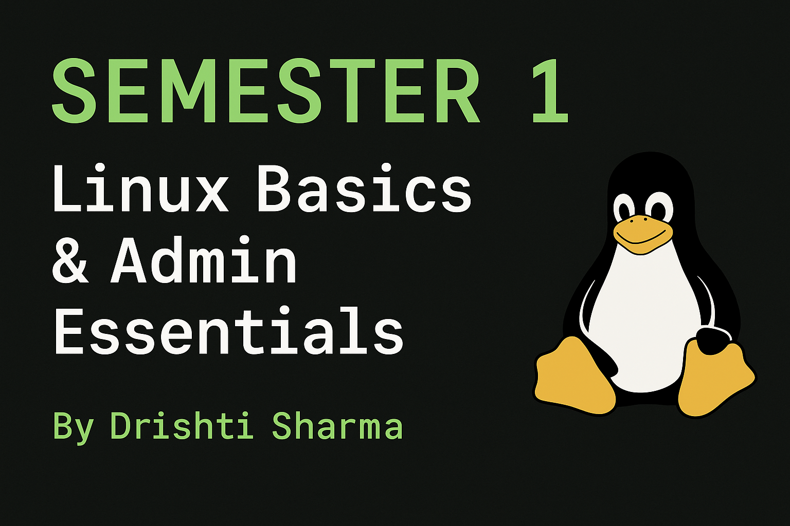

# 🧠 SEMESTER-1 — Linux Learning Journey 💻


> *By [Drishti Sharma](https://github.com/Drishti06Sharma)*  
> 🔗 [View Folder on GitHub](https://github.com/Drishti06Sharma/LINUX/tree/SEMESTER-1)


---

## 🐧 Welcome to Semester-1: Your Linux Foundation 🚀  

This semester builds your **core understanding of Linux**, including:  
✨ Basic commands  
✨ File system & storage  
✨ Process management  
✨ System administration  
✨ Shell scripting essentials  

Let’s make your learning journey *informative, visual, and interactive!* 💥  

---

## 📘 Overview Table

| 🧩 **Topic / Area** | 💡 **Key Concept** | ⚙️ **Usage / Description** | 🧠 **Common Commands** | 🏷️ **Badge** |
|:--------------------:|:------------------|:----------------------------|:------------------------|:--------------|
| 📁 **Basic Commands** | File & Directory Management | Used for navigating, listing, creating, and removing files/folders 📂 | `pwd`, `ls -l`, `cd`, `mkdir`, `rmdir`, `touch`, `rm` |  |
| 🔐 **Permissions** | File Ownership & Security | Controls **who can read/write/execute** a file 🔒 | `chmod 755 file`, `chown user:group file`, `umask 022` |  |
| 🧾 **File Operations** | View / Copy / Move / Delete Files | Helps manage and manipulate data easily 📄 | `cat`, `cp`, `mv`, `rm -r`, `head`, `tail` |  |
| 🧭 **Navigation & Hidden Files** | Exploring Linux Directories | Learn structure like `/home`, `/etc`, `/bin`, etc. 🗂️ | `cd ..`, `cd ~`, `ls -a`, `ls /etc` |  |
| 🔍 **Searching & Filtering** | Finding Files / Patterns | Helps search within files or across system 🔎 | `grep "word" file`, `find / -name "*.txt"`, `sort`, `uniq`, `wc` |  |
| 🧮 **Process Management** | Handling Running Tasks | View, monitor, and terminate processes 🧠 | `ps aux`, `top`, `kill PID`, `bg`, `fg`, `jobs` |  |
| 🔄 **Pipes & Redirection** | Chain Commands Together | Combine output from one command into another 🔁 | `ls | grep .sh`, `cat file > new.txt`, `echo "Hi" >> notes.txt` |  |
| 🧰 **System Info & CPU** | System Hardware, Memory, & Performance | Check CPU usage, disk, RAM details 💾 | `lscpu`, `free -h`, `df -h`, `du -sh`, `top`, `htop` |  |
| 🧑‍💻 **Shell Scripting** | Automation & Coding | Write scripts for repetitive tasks 🔁 | `echo`, `read`, `if`, `for`, `while`, `bash script.sh` |  |
| 🧩 **Environment & Variables** | Manage Shell Variables | Store reusable values for session 🌍 | `echo $PATH`, `export VAR=value`, `env`, `set` |  |
| 🧙‍♀️ **Advanced Tricks** | Shortcuts & Command Recall | Boost speed & productivity ⚡ | `alias ll='ls -la'`, `history`, `!!`, `Ctrl+R` |  |

---

## 🧠 System Administrator Must-Know Topics 👩‍💻  

| 🧩 **Concept** | 💡 **Description** | 🧰 **Commands / Tools** | 🏷️ **Purpose** |
|:----------------:|:------------------|:------------------------|:----------------|
| ⚙️ **CPU Monitoring** | Know how your CPU is performing and what processes are running. | `lscpu`, `top`, `htop`, `mpstat`, `uptime` | Check cores, load average, and active processes |
| 💾 **Storage Management** | Understand disks, partitions, and available space. | `df -h`, `du -sh`, `lsblk`, `fdisk -l` | Monitor usage, detect low space, and optimize storage |
| 👑 **Administrator Role** | Admin installs, updates, and manages software packages. | `sudo apt update`, `sudo apt install`, `yum install`, `dpkg -l` | Keep the system secure and up-to-date |
| 💡 **Package Installation** | Ability to install & manage external programs/tools. | `apt`, `dnf`, `yum`, `snap`, `dpkg` | Install utilities like Git, Vim, Curl, etc. |
| 🐚 **Shell Scripting Skills** | Should be able to automate common tasks using Bash. | `if`, `for`, `while`, `echo`, `read`, `sleep`, `case` | Automate backups, system checks, and tasks |
| 🧑‍💻 **Coding Awareness** | Should understand other code types (C, Python, etc.). | Run scripts: `python3 file.py`, `gcc code.c -o out` | Broaden problem-solving and debugging ability |
| 🔐 **User & Permission Management** | Control user access and group privileges. | `useradd`, `passwd`, `usermod`, `groups`, `sudo visudo` | Secure system by managing user rights |
| 🌐 **Network Knowledge** | Must know how to check connectivity & IP. | `ping`, `ifconfig`, `ip a`, `netstat -tulnp`, `curl` | Manage server connections & troubleshoot issues |

---

## 🎮 Practice Zone – Try It Yourself!  

| 🧠 **Task** | 💪 **Command** | 🎉 **Expected Output** |
|:-------------|:---------------|:------------------------|
| Check system processor info | `lscpu` | Displays CPU architecture and cores |
| View available disk space | `df -h` | Lists all mounted drives and sizes |
| Monitor running processes | `top` | Real-time process list & CPU usage |
| Create a new user | `sudo useradd student` | Adds a user named *student* |
| Install a package | `sudo apt install vim` | Installs Vim text editor |
| Run a script | `bash hello.sh` | Executes the bash script |
| Check system uptime | `uptime` | Shows how long system has been running |

---

## 💬 Tips & Tricks 💡  

> 🧠 Use `man <command>` to learn any command in detail.  
> 💪 Combine commands with pipes `|` for powerful one-liners.  
> 🪄 Example:  
> ```bash
> ps aux | grep bash
> alias cls='clear'
> echo "Hello Linux Learner!" >> welcome.txt
> ```

---


---

## 🎯 Recap  

✅ Basic commands mastered  
✅ File, process & storage management understood  
✅ Admin-level command familiarity gained  
✅ Shell scripting & automation learned  
✅ CPU and system awareness developed  

---

### 🏁 Stay Curious. Keep Practicing. Be the Linux Pro You’re Meant to Be! 🐧💻
````

---
