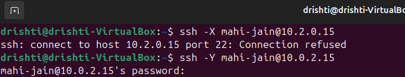

# SSH + X11 Quick Guide — Remote Access (with GUI) 🚀

**Purpose:** Fast, minimal steps to access a remote Linux laptop's GUI apps over SSH (X11 forwarding). Only proceed with **explicit permission** from the remote owner. 🙏

---

## ✅ Quick checklist (must read)

* You have **explicit permission** from the remote laptop owner. ✅
* Remote IP known (example: `10.0.2.15`). ✅
* Remote username known (example: `mahi-jain`). ✅
* Both machines are on the same network and reachable. ✅


---

## 1) One-liner: install & start SSH on the **remote** (Ubuntu/Debian) 🖥️

```bash
sudo apt update -y && sudo apt install -y openssh-server && sudo systemctl enable --now ssh && ip -4 addr show scope global | awk '/inet /{print $2}' | cut -d/ -f1 | head -n1
```

This installs the SSH server, starts it, and prints the remote IP. Share the IP with the client.

---

## 2) One-liner: connect from your **client** (Linux / macOS) 💻

Replace `username` and `REMOTE_IP`:

```bash
ssh -Y username@REMOTE_IP
```

Test a GUI app after login:

```bash
xclock &    # or: gedit & or: gnome-calculator &
```

If using WSL on Windows (start an X server like VcXsrv first):

```bash
export DISPLAY=$(grep -m1 nameserver /etc/resolv.conf | awk '{print $2}'):0 && ssh -Y username@REMOTE_IP
```

---

## 3) If you get `Permission denied (publickey,password)` ❌

On the **remote**, run these to allow password auth (owner must run):

```bash
sudo sed -i 's/^#\?PasswordAuthentication.*/PasswordAuthentication yes/' /etc/ssh/sshd_config
sudo systemctl restart ssh
sudo grep PasswordAuthentication /etc/ssh/sshd_config
```

Should show: `PasswordAuthentication yes` ✅

---

## 4) Quick troubleshooting 🔎

* **Connection refused** → SSH server not running. Run `sudo systemctl start ssh` on remote.
* **Permission denied** → wrong username/password or password auth disabled. Verify `whoami` on remote and confirm password.
* **Cannot open display** → ensure X server is running on client (XQuartz/VcXsrv) and use `ssh -Y`.
* **Ping test**: `ping REMOTE_IP` to check reachability.
* To see SSH logs on remote: `sudo journalctl -u ssh -n 200 --no-pager`.

---

## 5) VirtualBox note 🧩

If the remote is a VM using **NAT** (common `10.0.2.x`), other hosts on the LAN may not reach it. If you need both VMs visible on the same LAN, set **Network → Adapter 1 → Bridged Adapter** in the VM settings and restart the VM. 🌐

---

## 6) Super-short commands summary (copy-paste) ✂️

**Remote (install + show IP):**

```bash
sudo apt update -y && sudo apt install -y openssh-server && sudo systemctl enable --now ssh && ip -4 addr show scope global | awk '/inet /{print $2}' | cut -d/ -f1 | head -n1
```

**Client (connect):**

```bash
ssh -Y mahi-jain@10.0.2.15
```

**Enable password auth on remote (owner runs):**

```bash
sudo sed -i 's/^#\?PasswordAuthentication.*/PasswordAuthentication yes/' /etc/ssh/sshd_config && sudo systemctl restart ssh
```

---

## 🔐 Security reminder

* Turn on these services **only temporarily** while troubleshooting. Disable or tighten them afterwards.
* Prefer key-based authentication for secure persistent access, and never share passwords insecurely.

---

If you want, I can:

* Add a short section on **SSH key setup** (passwordless + secure) 🔑
* Add exact VirtualBox step-by-step screenshots 🖼️
* Produce a one-line combined script that the remote owner can paste to check everything ✅


