✌𝓞𝓑𝓙𝓔𝓒𝓣𝓘𝓥𝓔✌

# 🐧 Ultimate Guide to Essential Linux Commands 🚀
# 

---

## 1. 📂 `pwd` – Print Working Directory

> *“Where am I right now?”*  
Shows the **absolute path** of the current directory you are working in — super useful to avoid getting lost!


```bash
pwd
````

**Example output:**


/home/drishti


### PICTORIAL REPRESENTATION 📷

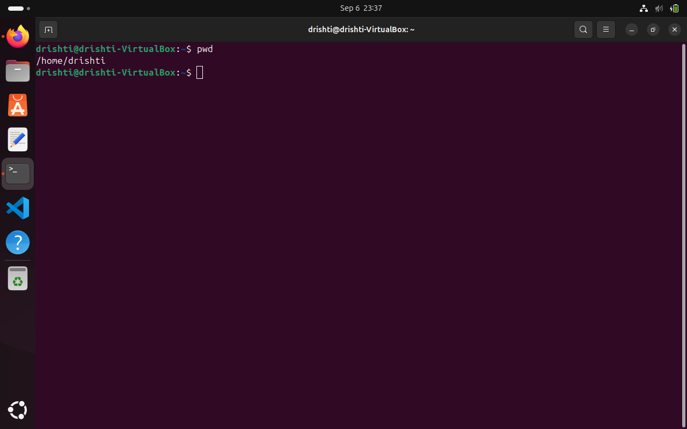


## 2. 📋 `ls` – List Directory Contents

> *“Show me what’s here!”*
> Lists all files and folders in the current directory. You can tweak it to show hidden files, detailed info, and more.


```bash
ls           # Basic list of files
ls -l        # Long list: shows permissions, owners, file size, and modification dates
ls -a        # Show hidden files (those starting with a dot “.”)
ls -la       # Combination of hidden and detailed files.
```

### PICTORIAL REPRESENTATION 📷

* ls *
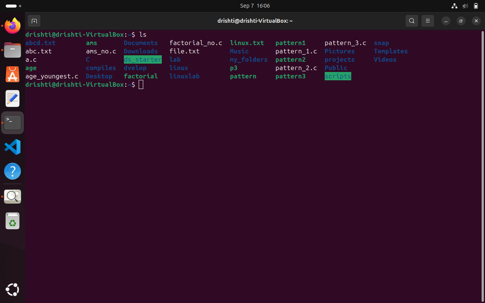


* ls -l *
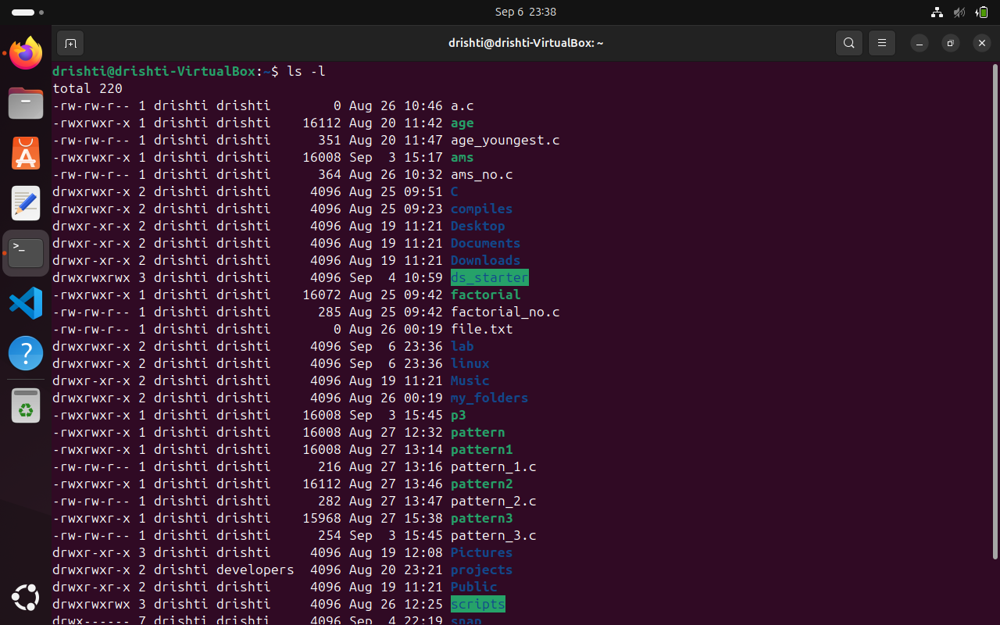


* ls -a *
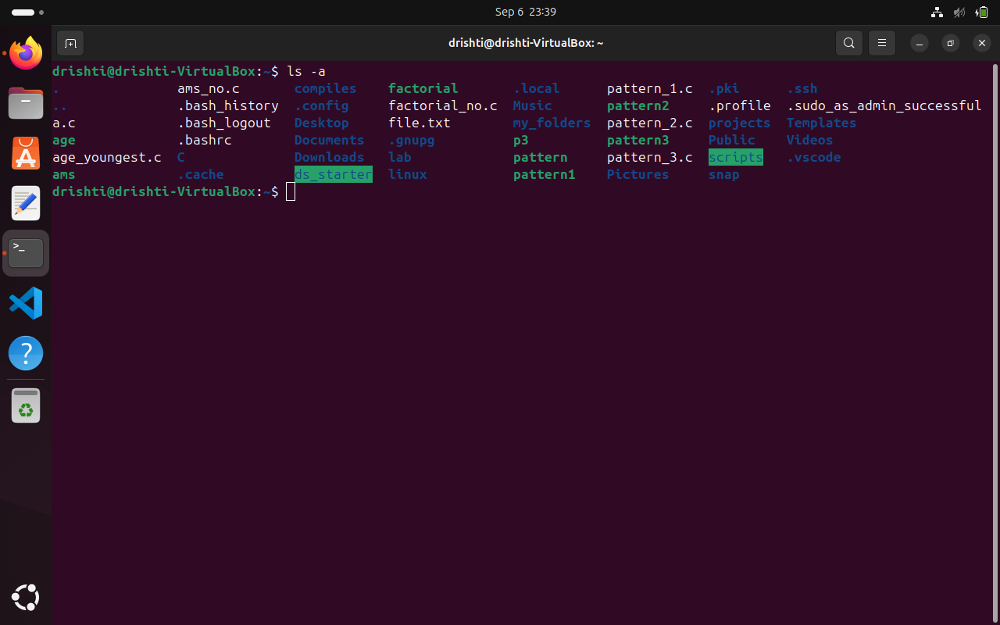


* ls -la *
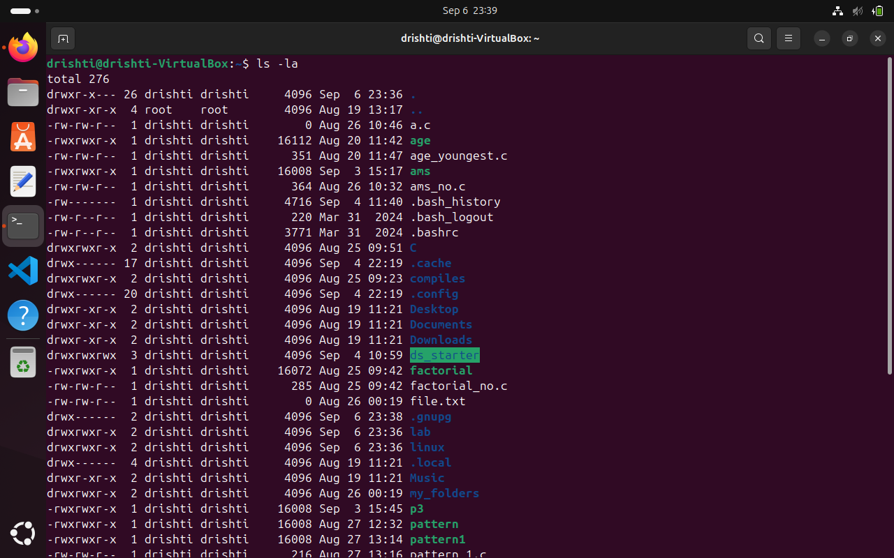


---

## 3. 📁 `cd` – Change Directory

> *“Take me somewhere else!”*
> Move between directories — the backbone of navigating your file system.


```bash
cd                   # goes back to main
cd ~                 # Shortcut to your home directory
cd ..                # Move up one level
cd -                 # Go back to the previous directory
```

### PICTORIAL REPRESENTATION 📷

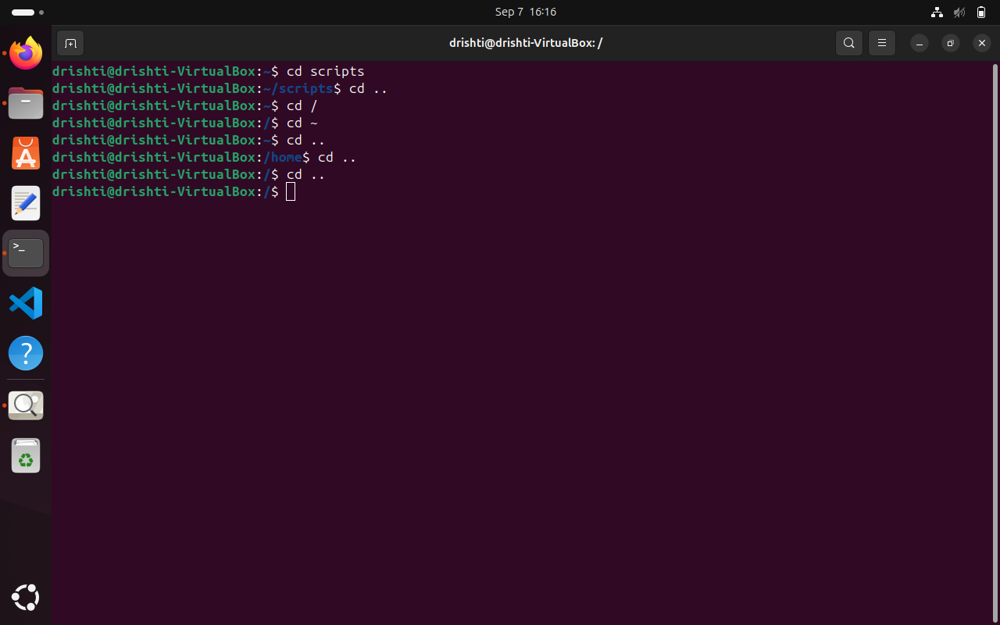


> 💡 **Shortcut:** Use `cd` alone to jump home. Handy for quick resets!

---

## 4. 🆕 `mkdir` – Make Directory

> *“Let’s create a new folder!”*
> Make a new directory to organize your files.


```bash
mkdir linuxlab
```

### PICTORIAL REPRESENTATION 📷

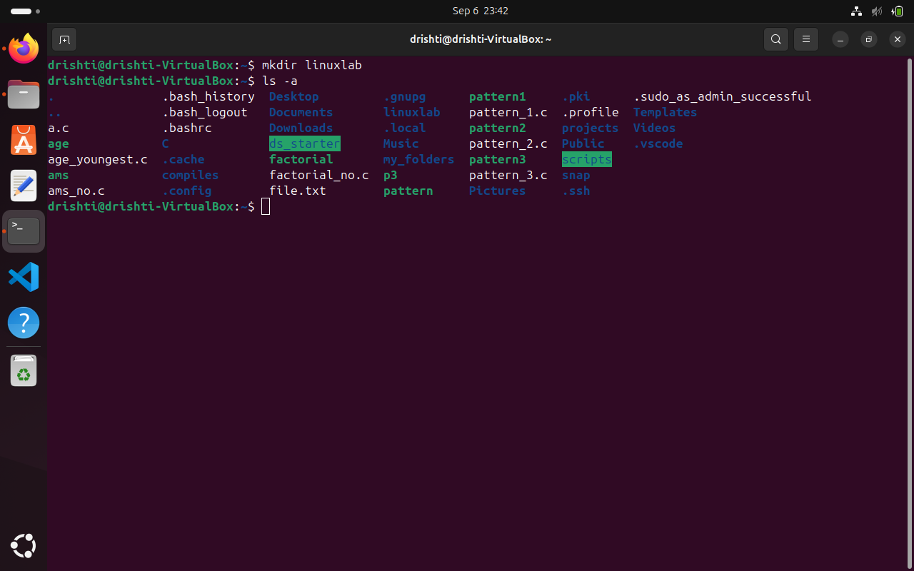


---

## 5. 📝 `touch` – Create or Update File Timestamp

> *“Make a file or update its clock”*
> Create an empty file or update an existing file’s “last modified” timestamp.

```bash
touch abc.txt
```
### PICTORIAL REPRESENTATION 📷

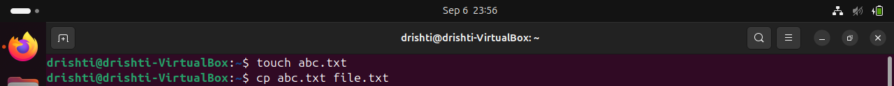


---

## 6. 📄 `cp` – Copy Files and Directories

> *“Duplicate this!”*
> Make a copy of files or whole directories.

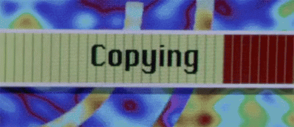

```bash
cp source.txt dest.txt               # Copy a single file
cp -r source_folder/ dest_folder/    # Recursively copy folders
cp -i file.txt backup/               # Interactive mode: asks before overwrite
```
### PICTORIAL REPRESENTATION 📷


## 7. 🚚 `mv` – Move or Rename Files

> *“Move it or rename it!”*
> Move files to a new location or rename them.

```bash
mv oldname.txt newname.txt           # Rename a file
mv file.txt /path/to/destination/    # Move file to another folder
```
### PICTORIAL REPRESENTATION 📷

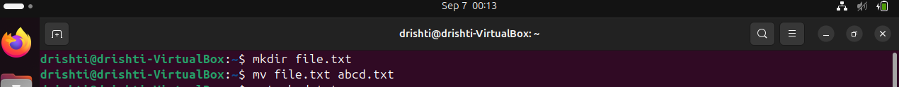

---

## 8. 🗑️ `rm` – Remove Files and Directories

> *“Delete, but be careful!”*
> Delete files or folders permanently — no recycle bin here!


```bash
rm file.txt                         # Remove a file
rm -r folder/                      # Recursively delete folder and contents
```

### PICTORIAL REPRESENTATION 📷

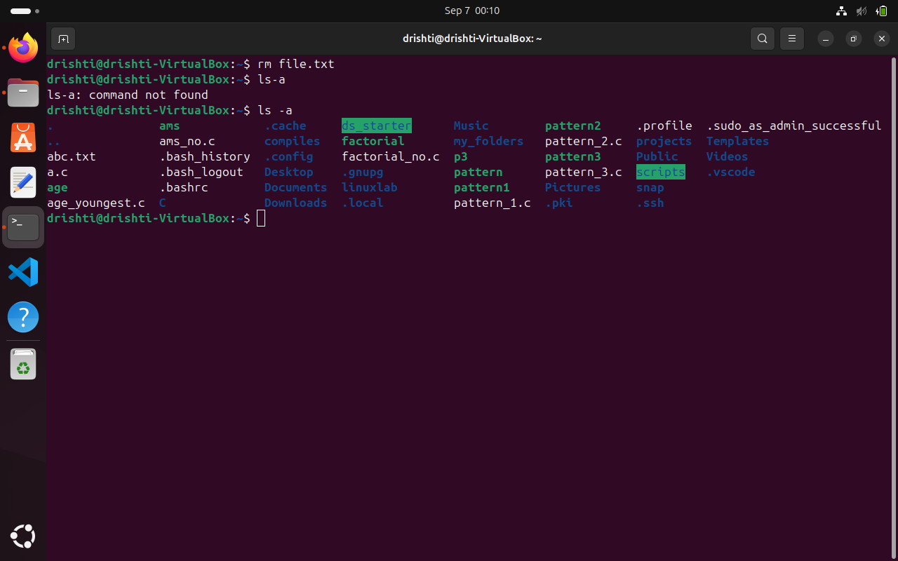

---

## 9. 📖 `cat` – Display File Contents

> *“Show me what’s inside!”*
> Read and output the entire content of a file.


```bash
cat abc.txt
```
### PICTORIAL REPRESENTATION 📷

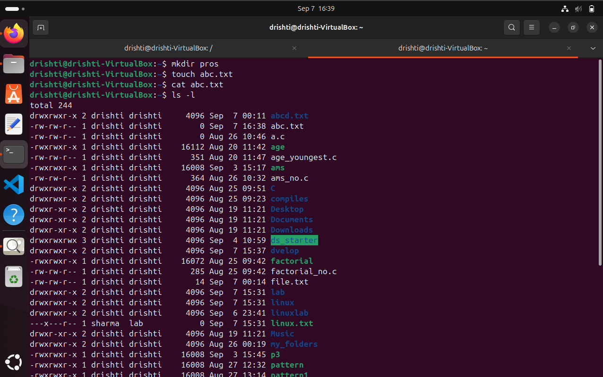


> 💡 **Pro tip:** Use `cat file1 file2 > combined` to concatenate files.

---

## 10. ✍️ `nano` – Terminal Text Editor

> *“Edit your files directly in the terminal!”*
> Simple, beginner-friendly text editor in your terminal.


```bash
nano file.txt
```

### PICTORIAL REPRESENTATION 📷

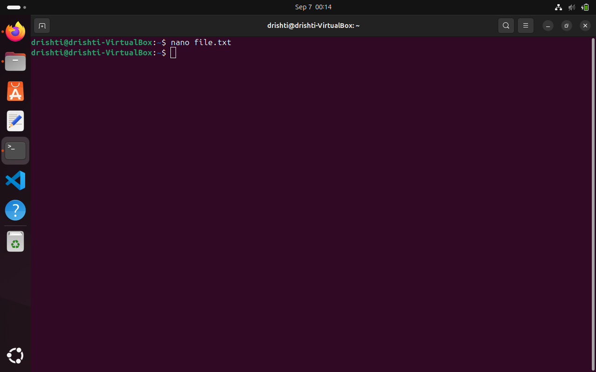


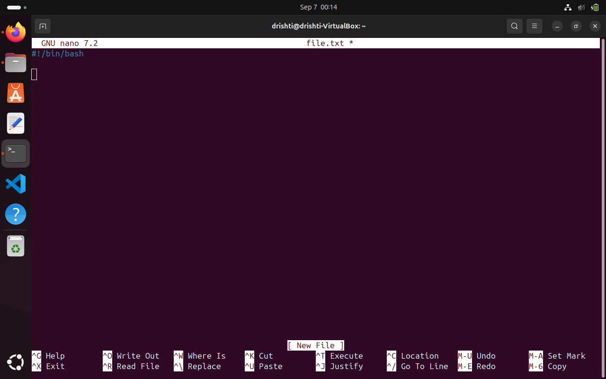

> 🔑 Save with `Ctrl + O`, exit with `Ctrl + X`, and get help with `Ctrl + G`.

---

## 11. 🗣️ `echo` – Print Text or Write to Files

> *“Say it loud!”*
> Print a line of text or write it into a file.


```bash
echo "Hello, World!"                # Display message on screen
```
### PICTORIAL REPRESENTATION 📷

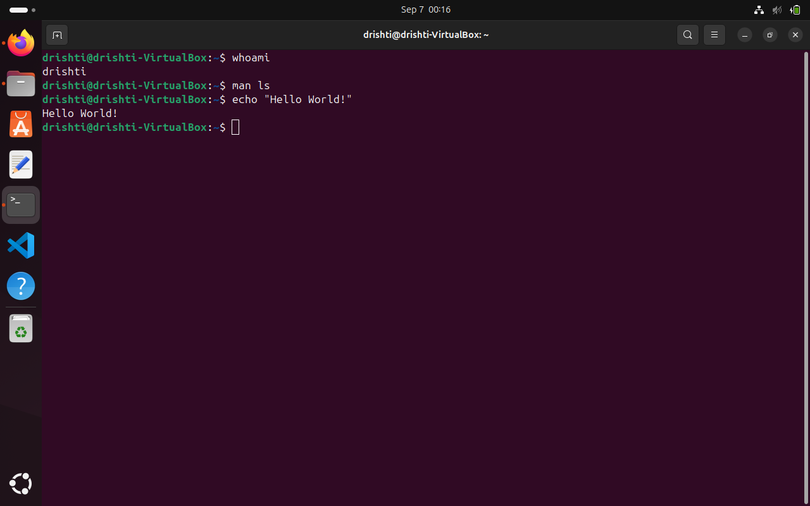

> 💡 **Use in scripts** to output messages or create files quickly.

---

## 12. 👤 `whoami` – Show Current User

> *“Who’s there?”*
> Shows which user account you are currently using.


```bash
whoami
```

### PICTORIAL REPRESENTATION 📷


---

## 13. 📚 `man` – Manual Pages

> *“Need help? Check the manual!”*
> View detailed help and documentation for commands.


```bash
man ls
```

### PICTORIAL REPRESENTATION 📷


---

## 14. 🔐 `chmod` – Change File Permissions

> *“Who can do what?”*
> Control read, write, and execute permissions on files and folders.


```bash
chmod 007 linux.txt         # others full access
chmod 402 linux.txt         # Owner read , Others write
chmod u+x linux.txt         # Owner dan execute
chmod o=r linux.txt         # Others read
```

> 🔍 **Permissions breakdown:**

| Digit | Permissions                |
| ----- | -------------------------- |
| 7     | Read, write, execute (rwx) |
| 6     | Read, write (rw-)          |
| 5     | Read, execute (r-x)        |
| 4     | Read only (r--)            |

---

| Permission | Meaning                                          |
| ---------- | ------------------------------------------------ |
| **r**      | Read – can view contents                         |
| **w**      | Write – can modify                               |
| **x**      | Execute – can run (files) or enter (directories) |

---

| User Type  | Meaning                    |
| ---------- | -------------------------- |
| **Owner**  | The user who owns the file |
| **Group**  | Users in the file's group  |
| **Others** | Everyone else              |

---

| Permission  | Numeric Value |
| ----------- | ------------- |
| read (r)    | 4             |
| write (w)   | 2             |
| execute (x) | 1             |
 
---

| Numeric | Permission | Explanation                    |
| ------- | ---------- | ------------------------------ |
| 7       | rwx        | read + write + execute (4+2+1) |
| 6       | rw-        | read + write (4+2)             |
| 5       | r-x        | read + execute (4+1)           |
| 4       | r--        | read only                      |
| 0       | ---        | no permissions                 |

---

# Symbolic mode (using letters)

You can also set permissions with letters:

u = user (owner)
g = group
o = others
a = all (user, group, others)

* And operators: *

+ add permission
- remove permission
= set exact permission


### PICTORIAL REPRESENTATION 📷


```chmod 007 linux.txt         # others full access ```


```chmod 402 linux.txt         # Owner read , Others write```

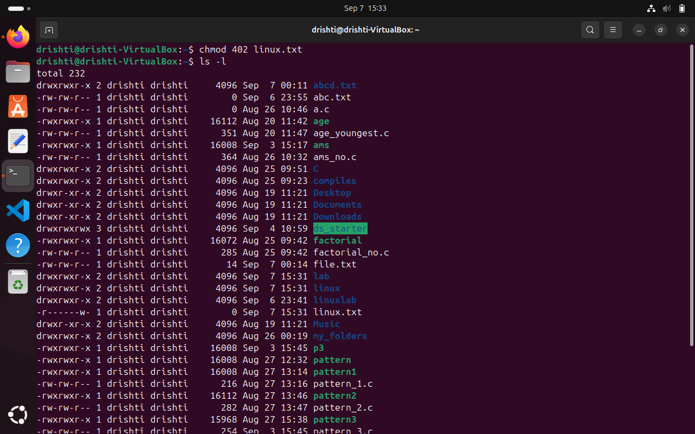

```chmod u+x linux.txt         # Owner dan execute```


```chmod o=r linux.txt         # Others read```

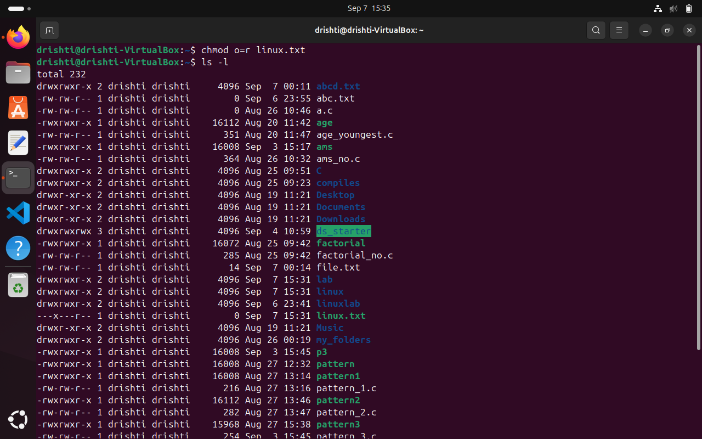


## 15. 👥 `chown` – Change Owner and Group

> *“Who owns this?”*
> Change ownership of files and directories (usually requires `sudo`).


```bash
sudo chown username:group file.txt
sudo chown -R user:group /path/to/folder  # Recursive ownership change
```

> 💡 **Tip:** Useful for fixing permission issues or when transferring files between users.


### PICTORIAL REPRESENTATION 📷

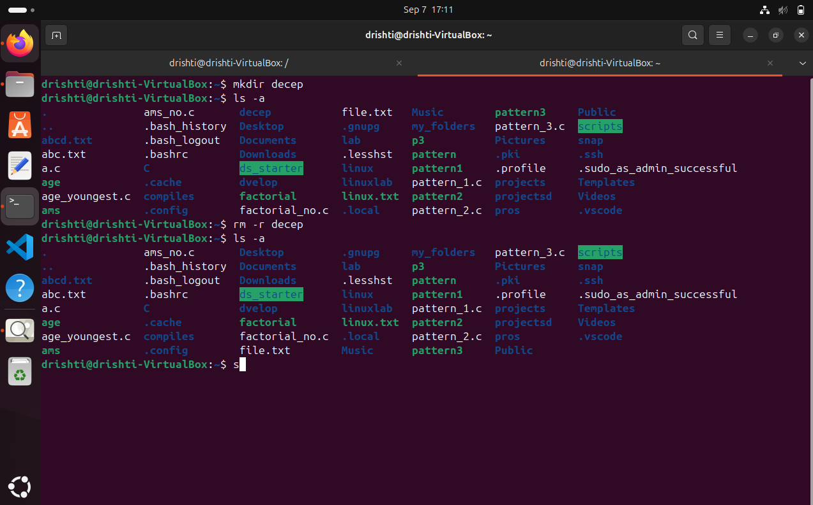

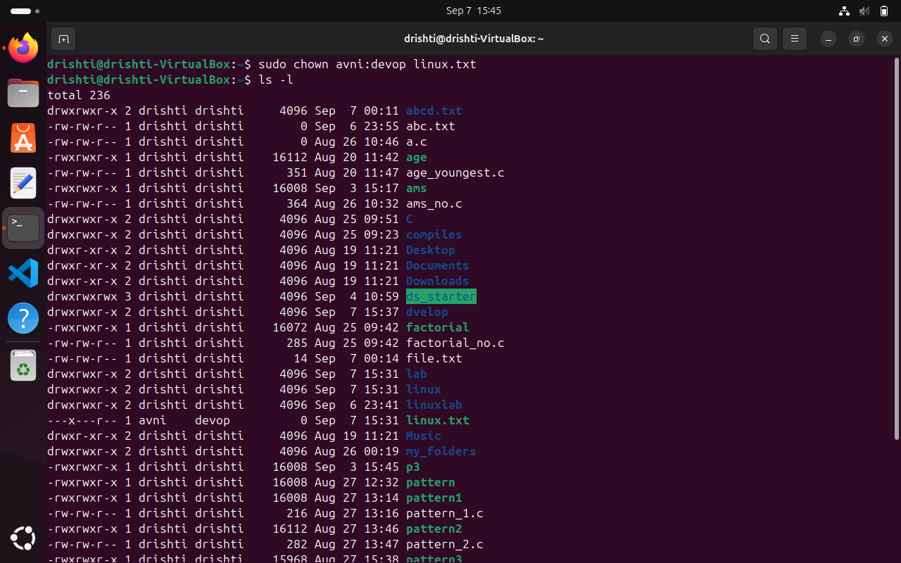

---


⁉️ ADDITIONAL QUESTIONS


🤔 WHAT IS THE DIFFRENCE BETWEEN CHOWN AND CHMOD?

| Command | Purpose                            | What it Changes              |
|---------|----------------------------------|-----------------------------|
| `chown` | Change **owner** and **group**   | Who **owns** the file       |
| `chmod` | Change **permissions**            | What **actions** are allowed (read, write, execute) |

**In short:**  
- `chown` = who owns the file  
- `chmod` = what can be done with the file


🤔 HOW DO YOU CHECK CURRENT DIRECTORY AND USER?


- We can check current directory through *pwd* command..
- We can check user through *whoami* command.


