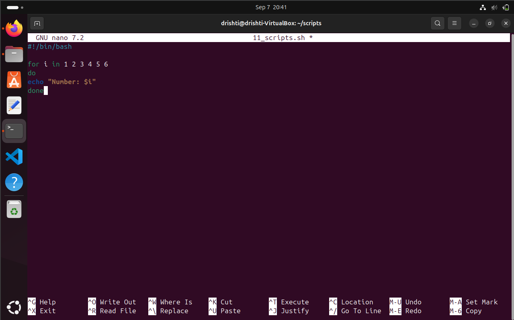
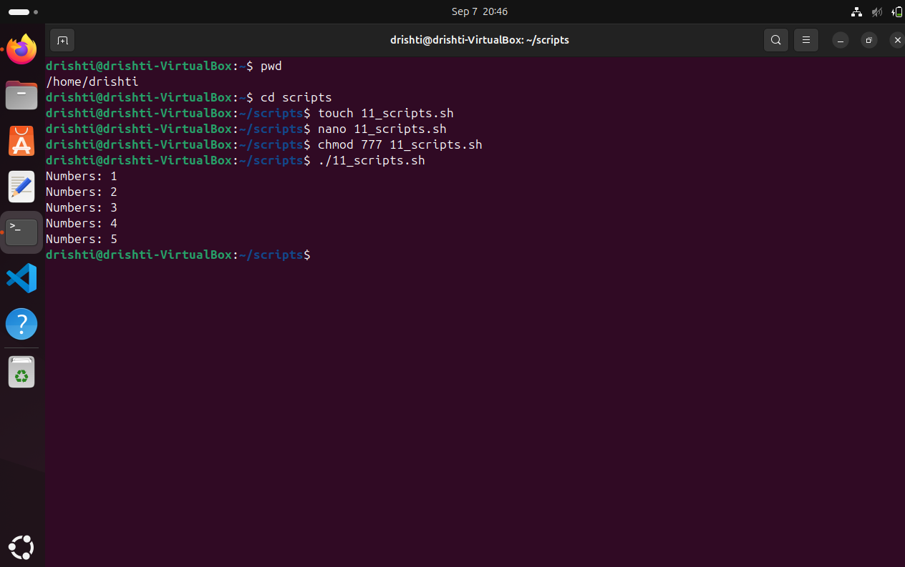
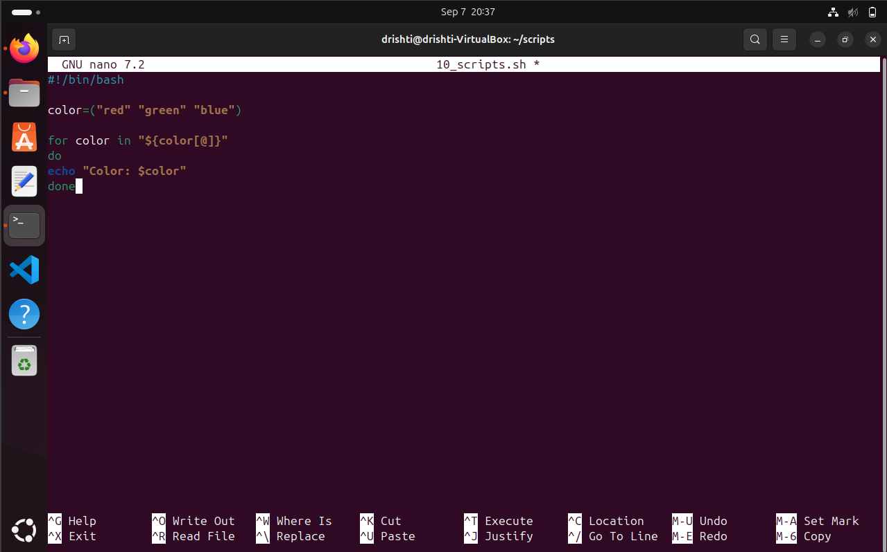
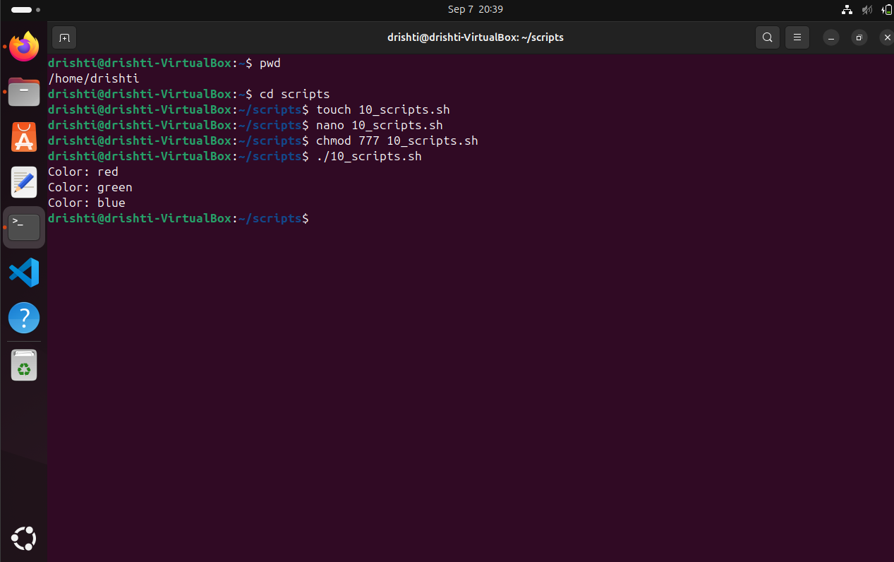

# 🐚 Shell Scripting

Shell scripting is a powerful tool to automate tasks in Unix/Linux systems. In this file, we’ll use a **real example** to learn how to loop through an array and print numbers. Let’s get started! 🚀

---

## 📌 What is a Shell Script?

> A **shell script** is a file containing a list of commands that the shell can execute.

Think of it like giving your computer a **to-do list** 📝.


---

## 🎯 What We'll Do

- 🔁 Loop through it
- 🖨️ Print the values

---

## 🧾 Sample Script

```bash
#!/bin/bash
for i in 1 2 3 4 5 
do
echo "Numbers: $i"
done

````

### PICTORIAL REPRESENTATION 📷



---

## 🧠 How It Works

| Line             | Description                                |
| ---------------- | ------------------------------------------ |
| `#!/bin/bash`    | Shebang - tells the system to use **Bash** |
| `for i in ...`   | Loops through the array                    |
| `echo "$i"`      | Prints each element                        |


---

## ▶️ Running the Script

        ctrl x + y + enter
        chmod 777 11_scripts.sh
        ./11_scripts.sh


## ✅ Output

```text

Number: 1
Number: 2
Number: 3
Number: 4
Number: 5
```

### PICTORIAL REPRESENTATION 📷



---


# 🎨 Bash Script Fun with Colors

Ever wondered how to loop through a list of colors in a Bash script? Let’s dive into this colorful journey! 🌈✨

---

## 🧾 The Script

```bash
#!/bin/bash

color=("red" "green" "blue")

for color in "${color[@]}"
do
  echo "Color: $color"
done
````

### PICTORIAL REPRESENTATION 📷




## 🔍 What’s Happening Here?


| Line               | Purpose                        |
| ------------------ | ------------------------------ |
| `#!/bin/bash`      | Use the Bash shell             |
| `colors=(...)`     | Define an array of colors      |
| `for color in ...` | Loop through the array         |
| `echo`             | Print each color to the screen |

---

## ✅ Output

```text

color: red
color: green
color: blue

```
### PICTORIAL REPRESENTATION 📷



⁉️ ADDITIONAL QUESTIONS

🤔 WHAT IS THE PURPOSE OF #!/bin/bash AT THE TOP OF A SCRIPT?

🧠 Purpose of #!/bin/bash

✅ Tells the system which interpreter to use to run the script.

🪄 #! is a special character sequence that tells the operating system:
"Use the program at the following path to execute this file."
/bin/bash is the path to the Bash shell (Bourne Again SHell), a common command-line interpreter on Linux .

🤔 HOW DO YOU MAKE A SCRIPT EXECUTABLE?

🪄 To make a script executable in Unix/Linux:

1. **Add a shebang :**
   At the top of the script, add:

   ```bash
   #!/bin/bash
   ```

2. **Give execute permission:**
   Run:

   ```bash
   chmod +x script_name
   ```

3. **Run the script:**
   Use:

   ```bash
   ./script_name
   ```

