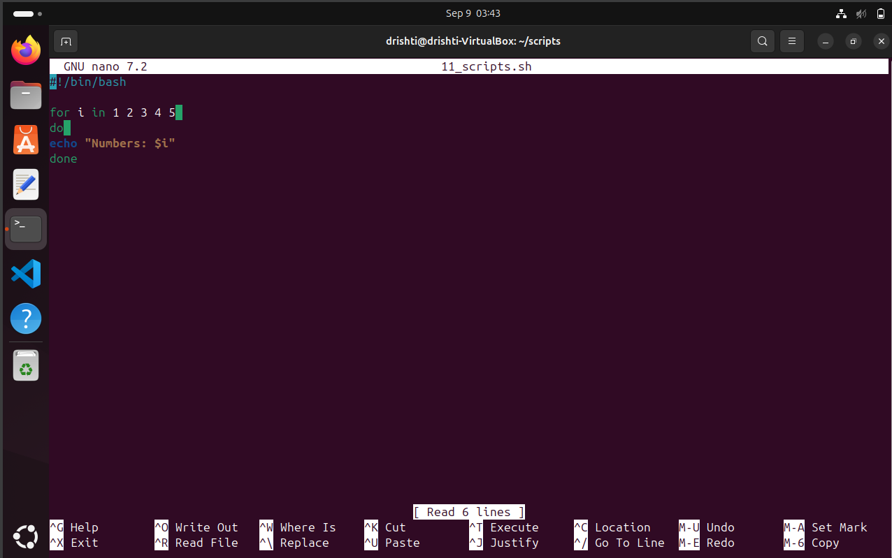
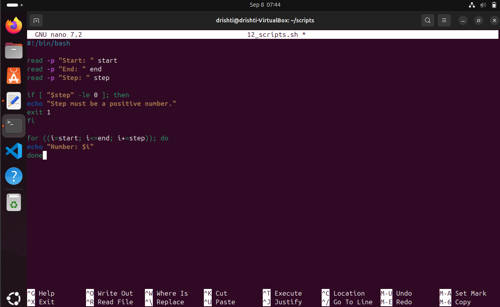
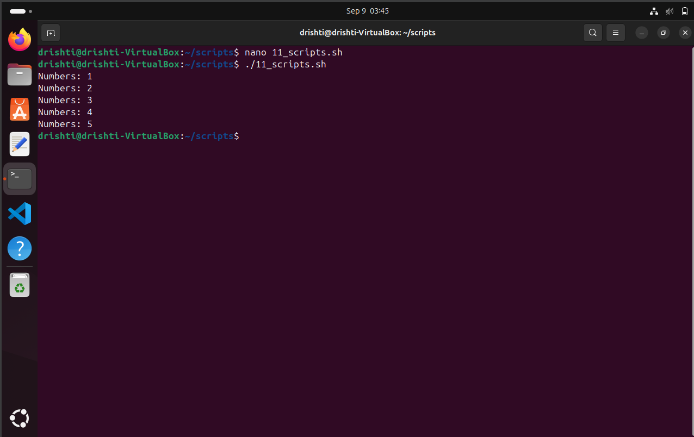
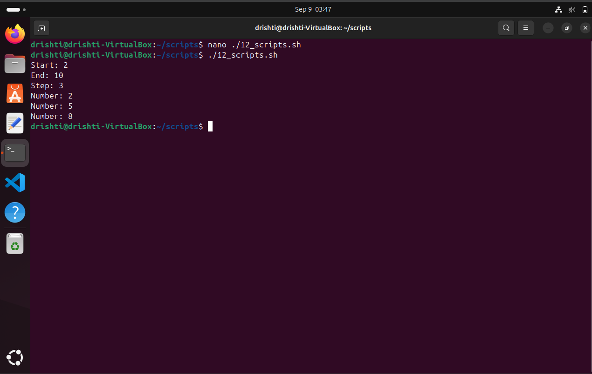
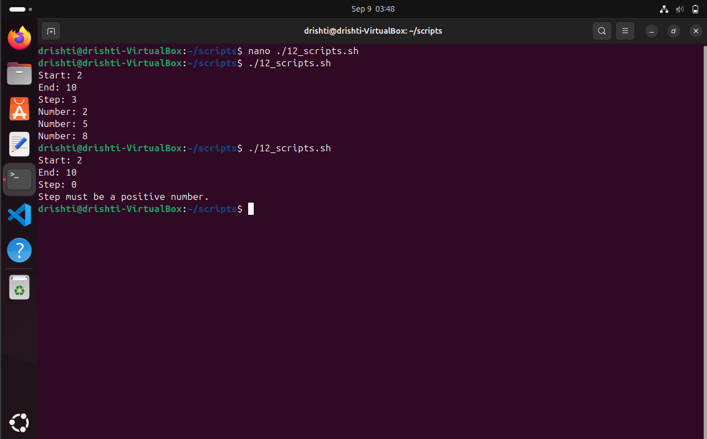
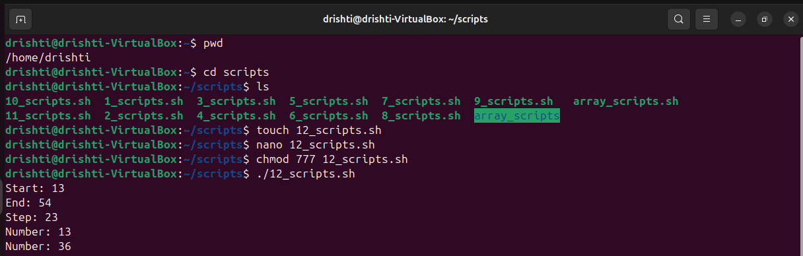
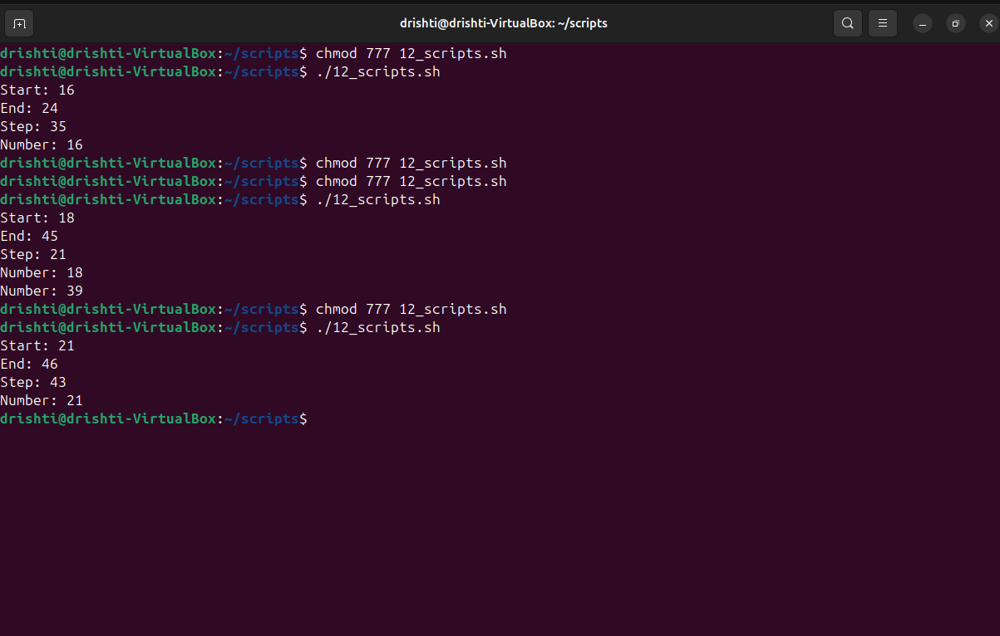

# 🚀 Working Comparison: Original Script vs. Enhanced Script

---

## 🧙‍♂️ Original Script Magic

```bash
for i in 1 2 3 4 5
do
  echo "Numbers: $i"
done
```

### How It Works 🔍

1. **🔢 Fixed Numbers:** The script already knows the sequence (1 to 5).
2. **🔄 Loop Time:** It takes each number from the list — one after another.
3. **🖨️ Print Party:** Prints `Numbers: i` for every number.
4. **🏁 Done:** Stops after printing `5`.

### Characteristics

* 🛤️ **Simple path:** No surprises, just a straight walk through fixed numbers.
* 🧩 **No input needed:** You don’t tell it anything; it just does its thing.
* 🐢 **Slow and steady:** Steps are always +1, hardcoded.

### Visual:



---

## 🧙‍♀️ Enhanced Script Wizardry

```bash
read -p "Start: " start
read -p "End: " end
read -p "Step: " step

if [ "$step" -le 0 ]; then
  echo "Step must be a positive number."
  exit 1
fi

for ((i=start; i<=end; i+=step)); do
  echo "Number: $i"
done
```

### How It Works 🔮

1. **📝 User Input:** You get to pick where to start, where to end, and how big your steps are!
2. **⚠️ Step Check:** If you try to cheat with zero or negative steps, it says:
   ❌ *“Step must be a positive number.”* and stops.
3. **🏃‍♂️ Loop Run:** Starts at your chosen `start`.
4. **📈 Condition:** Keeps going as long as the number is less than or equal to `end`.
5. **➕ Step Up:** Adds your step size after every print.
6. **🎉 Output:** Prints numbers along the way.
7. **🚦 Stop:** Ends when it reaches the finish line (`end`).

### Characteristics

* 🔥 **Fully customizable:** YOU decide how the sequence works.
* 🛡️ **Safety first:** Prevents crazy loops with step validation.
* 🎯 **Precise control:** Moves exactly by the step size you pick.

### Visual:



---

## 🎭 Side-by-Side Showdown

| Feature          | Original Script 🦕            | Enhanced Script 🚀                     |
| ---------------- | ----------------------------- | -------------------------------------- |
| Input            | None — fixed list             | User picks start, end, and step        |
| Loop Control     | For each number in fixed list | C-style `for` loop with arithmetic     |
| Loop Condition   | Ends after last fixed number  | Runs while `i <= end`                  |
| Step Size        | Always 1 (implicit)           | User-defined, validated to be positive |
| Validation       | ❌ None                        | ✅ Checks step, exits if invalid        |
| Behavior         | Straightforward, no surprises | Flexible, dynamic, user-driven         |
| User Interaction | Zero interaction              | Interactive input                      |

---

## 🤩 Example Time!

### Original Script Output

```
Numbers: 1
Numbers: 2
Numbers: 3
Numbers: 4
Numbers: 5
```

### Visual:



### Enhanced Script Output — Happy Path 🎉

```
Start: 2
End: 10
Step: 3

Number: 2
Number: 5
Number: 8
```

### Visual:



### Enhanced Script Output — Caught by Validation 🚫

```
Start: 2
End: 10
Step: 0

Step must be a positive number.
```
### Visual:



---

### EXAMPLE INPUTS AND OUTPUTS (Enhanced Script) :






---

⁉️ ADDITIONAL QUESTIONS:


🤔 DIFFERENCE BETWEEN $1, $@, AND $# IN BASH ?

| Variable | What It Means 🔍        | How It Behaves 💡                                                | 
| `$1`     | **First argument**      | Picks **only the very first** input you gave                     |
| `$@`     | **All arguments**       | Lists **every argument separately**, preserving spaces if quoted | 
| `$#`     | **Number of arguments** | Counts **how many** inputs you gave                              | 


🤔 WHAT DOES EXIT 1 MEAN IN A SCRIPT ?

`exit 1` is the script’s way of saying:

> **“Stop right there! 🚫 Something went wrong.”**

* `0` = 🎉 All good, mission accomplished!
* `1` (or any non-zero) = ⚠️ Uh-oh, error alert!


?


