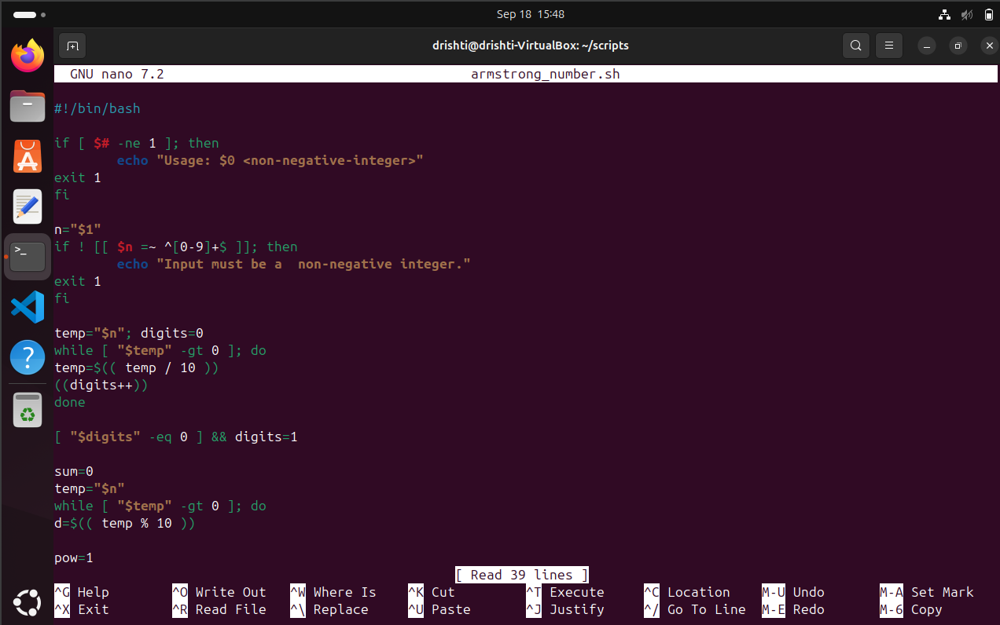
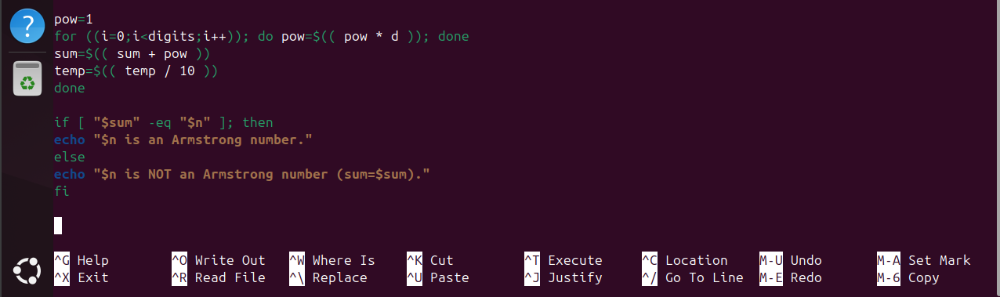
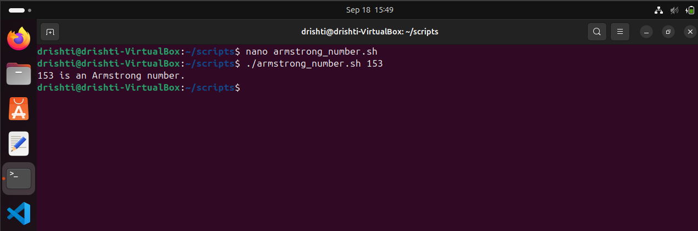
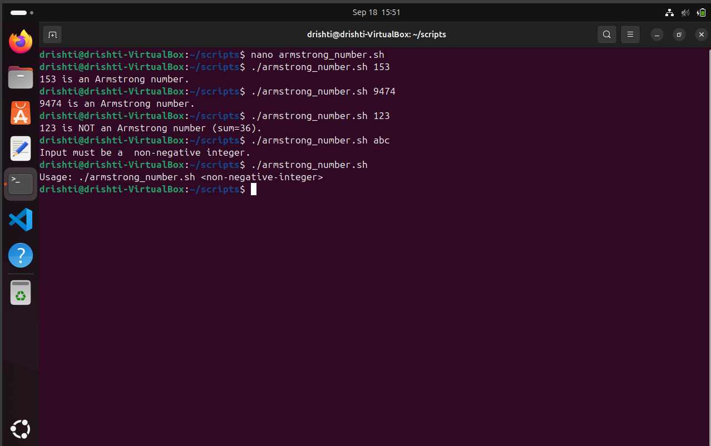

Absolutely! Here's a fun, clear, and **visually attractive `README.md`** file for your `armstrong.sh` script — complete with emojis, examples, and explanations to make it friendly and easy to understand. 🧠💥

---

````md
# 💪 `armstrong.sh` — Armstrong Number Checker 🔢✨

Ever wondered if a number is **Armstrong-worthy**? 🧠 This Bash script checks whether a given non-negative integer is an **Armstrong number** — numbers that are equal to the sum of their digits each raised to the power of the number of digits!

---

## 💡 What is an Armstrong Number?

An **Armstrong number** (also called a **narcissistic number**) is a number that is equal to the **sum of its own digits**, each raised to the power of the number of digits.

### 🔍 Examples:

- `153` → \(1^3 + 5^3 + 3^3 = 153\) ✅  
- `9474` → \(9^4 + 4^4 + 7^4 + 4^4 = 9474\) ✅  
- `123` → ❌ Not an Armstrong number

---

## CODE:💻

```
#!/bin/bash
` armstrong.sh
` Usage: ./armstrong.sh 153

if [ $# -ne 1 ]; then
  echo "Usage: $0 <non-negative-integer>"
  exit 1
fi

n="$1"
if ! [[ $n =~ ^[0-9]+$ ]]; then
  echo "Input must be a non-negative integer."
  exit 1
fi

# count digits
temp="$n"; digits=0
while [ "$temp" -gt 0 ]; do
  temp=$(( temp / 10 ))
  ((digits++))
done
# handle zero
[ $digits -eq 0 ] && digits=1

sum=0
temp="$n"
while [ "$temp" -gt 0 ]; do
  d=$(( temp % 10 ))
  # compute d^digits
  pow=1
  for ((i=0;i<digits;i++)); do pow=$(( pow * d )); done
  sum=$(( sum + pow ))
  temp=$(( temp / 10 ))
done

if [ "$sum" -eq "$n" ]; then
  echo "$n is an Armstrong number."
else
  echo "$n is NOT an Armstrong number (sum=$sum)."
fi

```
### VISUALIZATION:📷




### 📜 Script Usage

```bash
./armstrong.sh <non-negative-integer>
````

### 🧪 Example

```bash
./armstrong.sh 153
```

➡️ Output:

```
153 is an Armstrong number.
```

### VISUALIZATION:📷


---

## ⚙️ How It Works

🔢 The script:

1. ✅ Checks if exactly **one argument** is passed
2. 📂 Validates that the input is a **non-negative integer**
3. 📏 Counts the number of digits
4. 🔁 Loops through each digit and raises it to the power of the total digits
5. ➕ Adds the powers together
6. 🤔 Compares the sum to the original number
7. 📣 Prints the result

---

## 🧠 Example Output

```bash
$ ./armstrong.sh 9474
9474 is an Armstrong number.

$ ./armstrong.sh 123
123 is NOT an Armstrong number (sum=36).

$ ./armstrong.sh abc
Input must be a non-negative integer.

$ ./armstrong.sh
Usage: ./armstrong.sh <non-negative-integer>
```
### VISUALIZATION:📷


---

## 🛠️ What's Inside the Script?

* 🔁 `while` loops for digit counting and reversing
* 🧮 Manual calculation of powers (no `math` libraries!)
* 🧼 Clean error handling
* 💬 Clear user messages

---

