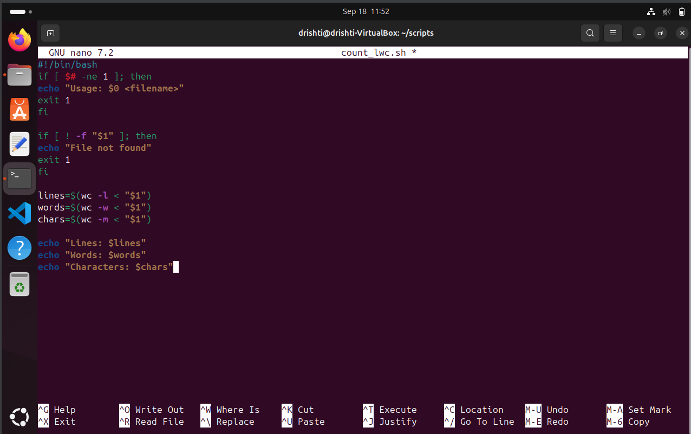
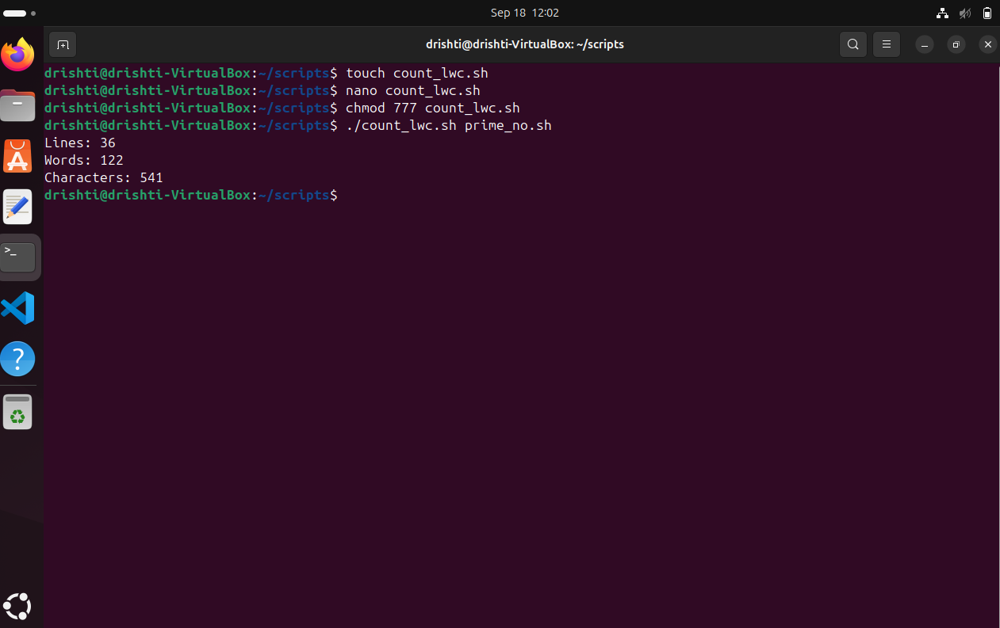

# 📄 `count_lwc.sh` — Count Lines, Words, and Characters 🔢✨

A quick and handy **Bash script** to count the number of:

- 📘 **Lines**
- 📝 **Words**
- 🔠 **Characters**

...in any text file you provide!

---

## 🚀 Usage

```bash
./count_lwc.sh <filename>
````

🧪 **Example:**

```bash
./count_lwc.sh prime_no.sh
```

---

### CODE:💻
```

#!/bin/bash
# count_lwc.sh
# Usage: ./count_lwc.sh filename.txt

if [ $# -ne 1 ]; then
  echo "Usage: $0 <filename>"
  exit 1
fi

if [ ! -f "$1" ]; then
  echo "File not found."
  exit 1
fi

lines=$(wc -l < "$1")
words=$(wc -w < "$1")
chars=$(wc -m < "$1")

echo "Lines: $lines"
echo "Words: $words"
echo "Characters: $chars"

```

## PICTORIAL REPRESNTATION:📷





## 🧠 What It Does

This script:

1. ✅ Verifies the **file is provided**
2. 📂 Checks if the **file exists**
3. 📊 Uses `wc` to count:

   * Lines (`wc -l`)
   * Words (`wc -w`)
   * Characters (`wc -m`)
4. 📢 Prints the results in a clear format

---

## 🔍 Sample Output

```bash
Lines: 36
Words: 122
Characters: 541
```
### PICTORIAL REPRESENTATION:📷


---

## ⚠️ Error Handling

### ❌ No file argument provided:

```bash
Usage: ./count_lwc.sh <filename>
```

### ❌ File doesn't exist:

```bash
File not found.
```

---

## 🛠️ Under the Hood

This script uses simple but powerful shell features:

* `wc -l` — Counts lines 📘
* `wc -w` — Counts words 📝
* `wc -m` — Counts characters 🔠
* Input redirection (`< "$1"`) for clean output

---


