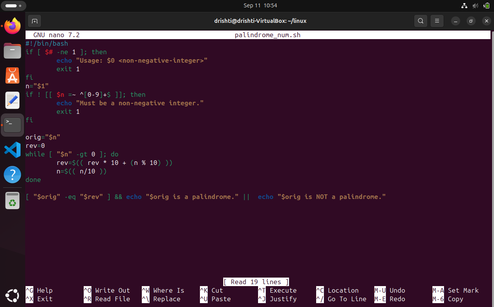
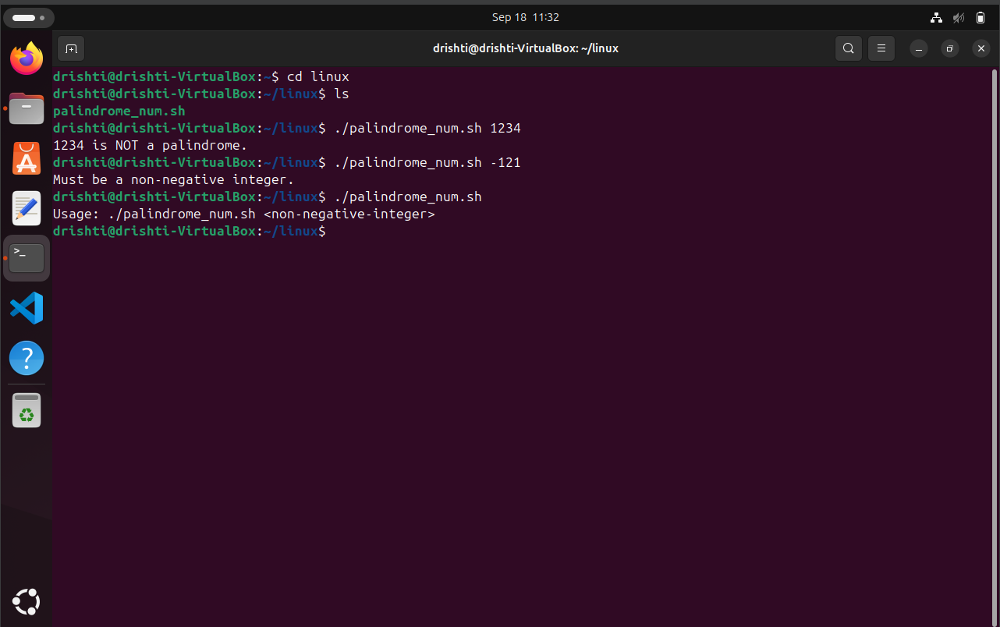

# 🔁 `palindrome_num.sh` — Check for Palindromic Numbers 🧮✨

Ever wondered if a number reads the same backward and forward?  
This handy **Bash script** checks if a given **non-negative integer** is a **palindrome**! 🔍💡

---

## 🚀 Usage

```bash
./palindrome_num.sh <non-negative-integer>
````

🧪 **Example:**

```bash
./palindrome_num.sh 1221
```

---

### CODE:💻

```
#!/bin/bash
# palindrome_num.sh
# Usage: ./palindrome_num.sh 1221

if [ $# -ne 1 ]; then
  echo "Usage: $0 <non-negative-integer>"
  exit 1
fi
n="$1"
if ! [[ $n =~ ^[0-9]+$ ]]; then
  echo "Must be a non-negative integer."
  exit 1
fi

orig="$n"
rev=0
while [ "$n" -gt 0 ]; do
  rev=$(( rev * 10 + (n % 10) ))
  n=$(( n / 10 ))
done

[ "$orig" -eq "$rev" ] && echo "$orig is a palindrome." || echo "$orig is NOT a palindrome."
```


### PICTORIAL REPRESENTATION:📷





## 💬 What It Does

For any number you input:

* 🔄 It **reverses the digits**
* 🤔 Compares the reversed number with the original
* ✅ Tells you if it's a **palindrome**!

---

## 🧠 How It Works

📜 Inside the script:

1. ✅ **Checks** that exactly **1 argument** is provided
2. 🚫 **Validates** that the input is a non-negative integer using regex
3. 🔢 **Reverses** the number using arithmetic operations
4. 🤝 **Compares** original and reversed values
5. 🗣️ **Prints** whether it's a palindrome

---

## 🧪 Sample Outputs

```bash
$ ./palindrome_num.sh 1221
1221 is a palindrome. ✅

$ ./palindrome_num.sh 1234
1234 is NOT a palindrome. ❌

$ ./palindrome_num.sh -121
Must be a non-negative integer. ⚠️

$ ./palindrome_num.sh
Usage: ./palindrome_num.sh <non-negative-integer>
```

### PICTORIAL REPRESENTATION:📷


---

## 🔐 Input Validation

* ✅ Only accepts **non-negative integers**
* 🧼 Rejects strings, special characters, and negative numbers
* 🛑 Exits with helpful error messages when misused

---


