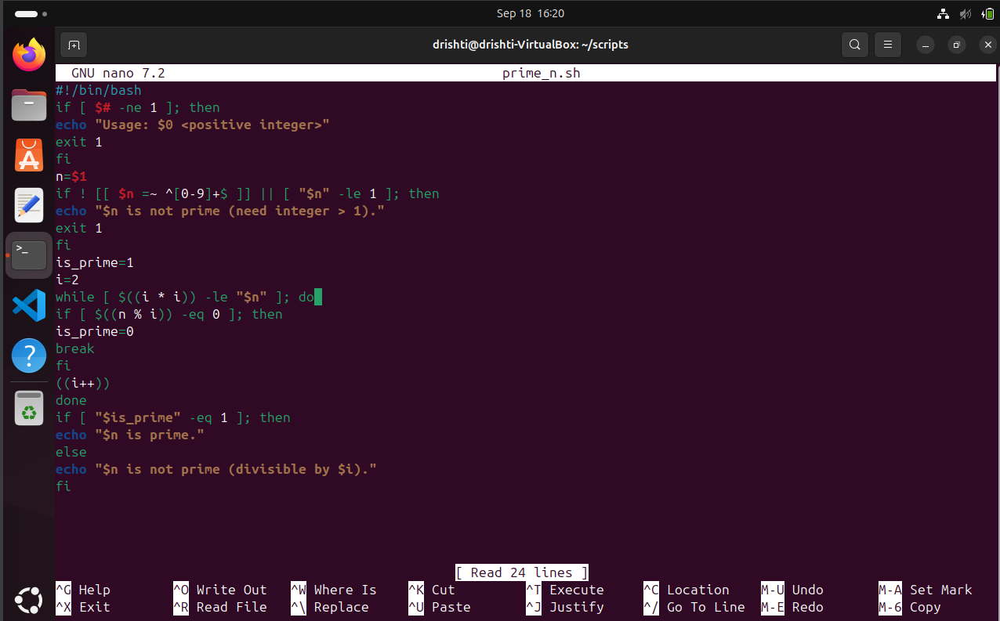
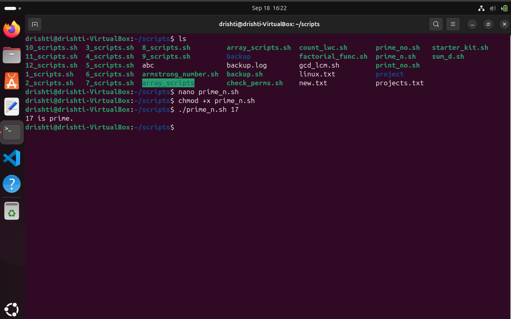
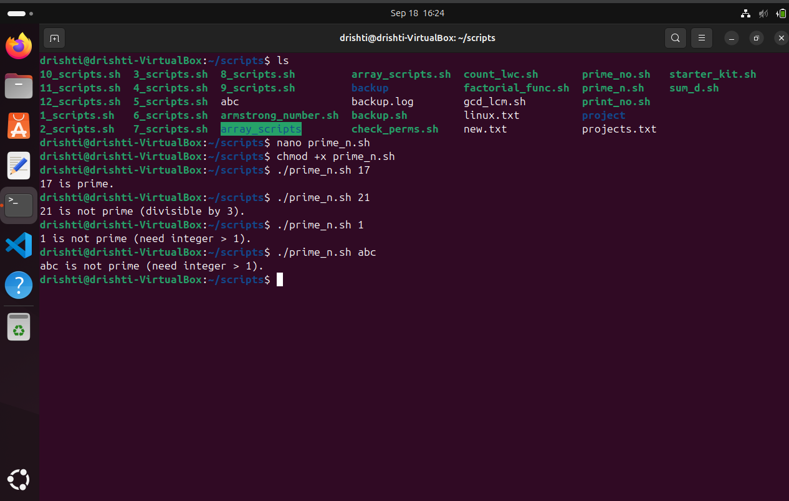

Certainly! Here's a creative, fun, and attractive `README.md` for your `prime_check.sh` script, packed with emojis and clear explanations to make it engaging and easy to follow! 🚀🔢✨

---

````md
# 🧮 `prime_check.sh` — Prime Number Checker ğŸ”✨

Wondering if a number is **prime**?  
This easy-to-use **Bash script** checks whether a given **positive integer** is a prime number! ğŸ’🔢

---
### CODE:💻

```
#!/bin/bash
# prime_check.sh
# Usage: ./prime_check.sh 17

if [ $# -ne 1 ]; then
  echo "Usage: $0 <positive-integer>"
  exit 1
fi

n=$1
if ! [[ $n =~ ^[0-9]+$ ]] || [ "$n" -le 1 ]; then
  echo "$n is not a prime (need integer > 1)."
  exit 1
fi

is_prime=1
i=2
while [ $((i * i)) -le "$n" ]; do
  if [ $((n % i)) -eq 0 ]; then
    is_prime=0
    break
  fi
  ((i++))
done

if [ $is_prime -eq 1 ]; then
  echo "$n is prime."
else
  echo "$n is NOT prime (divisible by $i)."
fi
```

### VISUALIZATION OF CODE:📷



## 🚀 Usage

```bash
./prime_check.sh <positive-integer>
````

### Example:

```bash
./prime_check.sh 17
```

â¡ï¸ Output:

```
17 is prime.
```
### OUTPUT VISUALIZATION:📷



---

## 🔠What is a Prime Number?

A **prime number** is a number greater than 1 that has **no divisors other than 1 and itself**.

* Examples of primes:
  2ï¸âƒ£, 3ï¸âƒ£, 5ï¸âƒ£, 7ï¸âƒ£, 11ï¸âƒ£, 13ï¸âƒ£, 17ï¸âƒ£, 19ï¸âƒ£, 23ï¸âƒ£, 29ï¸âƒ£...
* Non-primes have other divisors, e.g.,
  4 (divisible by 2), 6 (divisible by 2 and 3), etc.

---

## âš™ï¸ How It Works

1. ✅ Checks if exactly **one argument** is provided
2. 📋 Validates that the input is a **positive integer greater than 1**
3. 🔠Loops from `2` up to `√n` checking for divisors
4. 🚫 If a divisor is found, stops and reports **not prime**
5. 🉠Otherwise, confirms the number is **prime**

---

## 🧠 Sample Runs

```bash
$ ./prime_check.sh 17
17 is prime.

$ ./prime_check.sh 21
21 is NOT prime (divisible by 3).

$ ./prime_check.sh 1
1 is not a prime (need integer > 1).

$ ./prime_check.sh abc
abc is not a prime (need integer > 1).
```
### OUTPUT VISUALIZATION:📷




---

