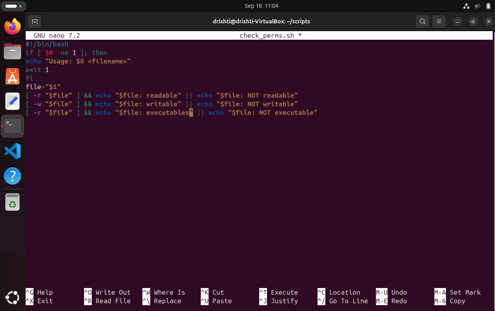
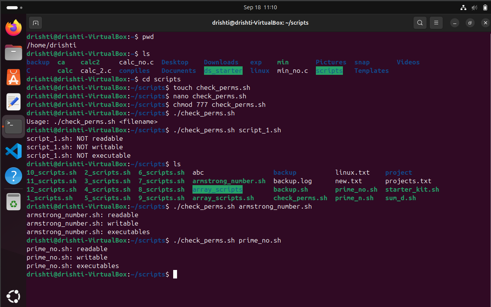

# 🔐 `check_perms.sh` – File Permission Checker 🛠️

A simple **Bash script** to quickly check if a given file is:

- ✅ Readable  
- 📝 Writable  
- ⚙️ Executable  

---

## 📄 Usage

```bash
./check_perms.sh <filename>
````

Example:

```bash
./check_perms.sh scripts_1.sh
./check_perms.sh armstrong_no.sh
./check_perms.sh prime_no.sh
```

---

## 💡 Features

* ✅ Shows if a file can be **read**
* 📝 Shows if a file can be **written**
* ⚙️ Shows if a file can be **executed**
* 🚫 Displays usage help if no argument is provided

---

## 🔍 Sample Output
$ ./check_perms.sh

scripts_1.sh: NOT readable ❌
scripts_1.sh: NOT writable ❌
scripts_1.sh: NOT executable ❌

---

## 🔍 Sample Output
$ ./check_perms.sh

armstrong_no.sh :  readable ✅
armstrong_no.sh :  writable ✅
armstrong_no.sh :  executable ✅

---

## 🔍 Sample Output
$ ./check_perms.sh

prime_no.sh :  readable ✅
prime_no.sh :  writable ✅
prime_no.sh :  executable ✅

---


## 🧠 How It Works

The script uses these built-in Bash conditionals:

* `[ -r "$file" ]` → checks if the file is **readable**
* `[ -w "$file" ]` → checks if the file is **writable**
* `[ -x "$file" ]` → checks if the file is **executable**

And it gives simple output with logical **AND (`&&`)** and **OR (`||`)** operators.

---

## 🛑 Error Handling

If you don't provide exactly **1 argument**, it prints:

```bash
Usage: ./check_perms.sh <filename>
```

---

### PICTORIAL REPRESENTATION:📷


