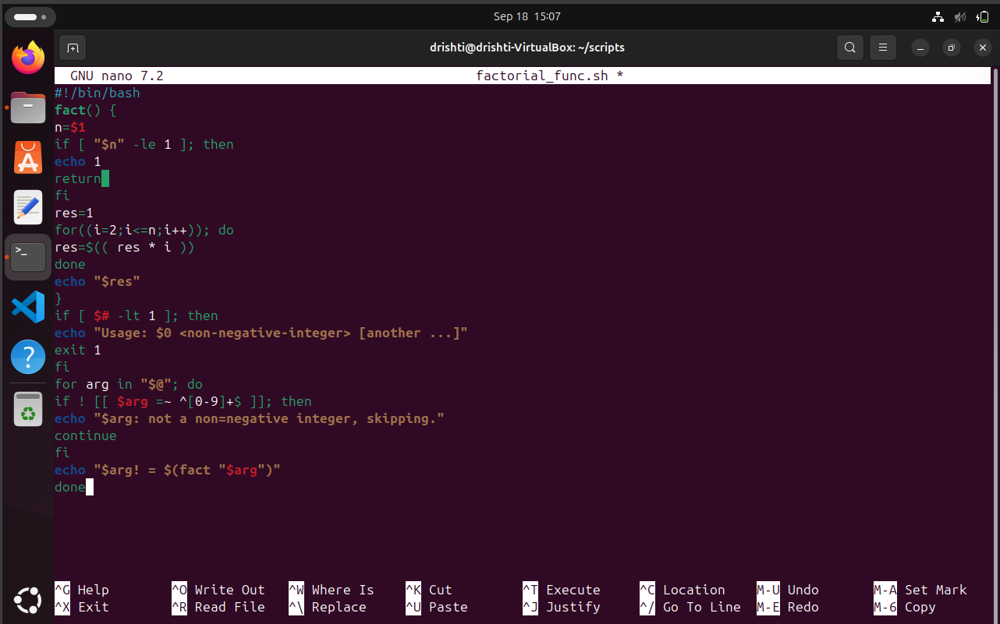
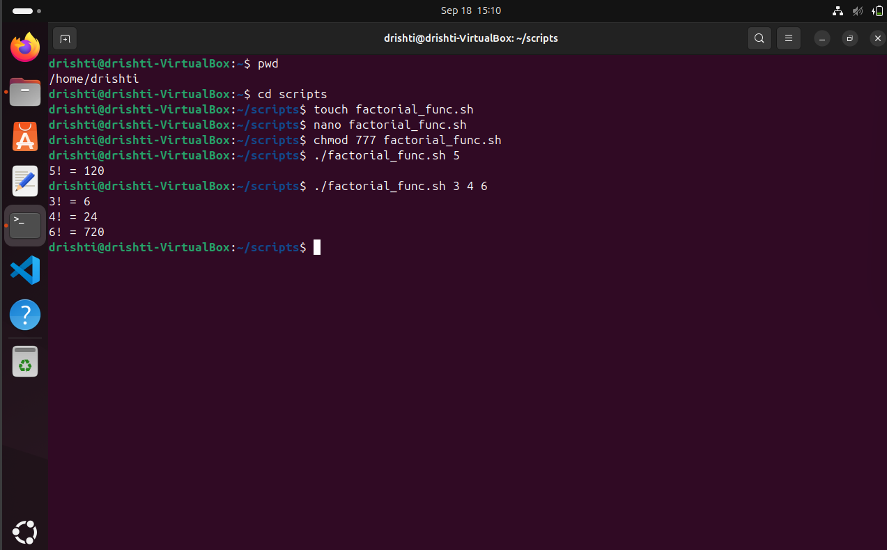

# ➗ `factorial.sh` — Factorial Finder! 🎉

This Bash script calculates the **factorial** of any non-negative integer(s) you provide — because math is fun! 🔢🚀

---

## 🧮 What is a Factorial?

The **factorial** of a number `n` (written as `n!`) is:


```

n! = n × (n-1) × (n-2) × ... × 1

```
Example:
```

5! = 5 × 4 × 3 × 2 × 1 = 120

```

---

### CODE:💻
```#!/bin/bash
# factorial.sh
# Usage: ./factorial.sh 5

fact() {
  n=$1
  if [ "$n" -le 1 ]; then
    echo 1
    return
  fi
  res=1
  for ((i=2;i<=n;i++)); do
    res=$(( res * i ))
  done
  echo "$res"
}

if [ $# -lt 1 ]; then
  echo "Usage: $0 <non-negative-integer> [another ...]"
  exit 1
fi

for arg in "$@"; do
  if ! [[ $arg =~ ^[0-9]+$ ]]; then
    echo "$arg: not a non-negative integer, skipping."
    continue
  fi
  echo "$arg! = $(fact "$arg")"
done

```
### PICTORIAL REPRESENTATION OF CODE:📷💻



## 🚀 Usage

```bash
./factorial.sh <non-negative-integer> [another ...]
````

You can enter **one** or **multiple** numbers!

### 🔧 Examples

```bash
./factorial.sh 5
```

➡️ Output:

```
5! = 120
```

```bash
./factorial.sh 3 4 6
```

➡️ Output:

```
3! = 6
4! = 24
6! = 720
```

---

### VISUALIZATION:📷



## ✅ Features

* 🔁 **Handles multiple inputs** at once!
* 🛡️ **Validates** input to ensure it’s a non-negative integer
* 💡 Uses a simple `for` loop to calculate the factorial
* 🚫 Skips invalid inputs with a friendly message

---

## 🧠 How It Works

* Checks if at least one argument is given (`$# -lt 1`)
* Validates each input using regex (`^[0-9]+$`)
* Skips any input that isn't a valid non-negative integer
* Uses a loop to calculate factorials for valid inputs

---

## ⚠️ Error Handling

### 🛑 No Input Provided

```bash
Usage: ./factorial.sh <non-negative-integer> [another ...]
```

### 🛑 Invalid Input

```bash
hello: not a non-negative integer, skipping.
```

---

## 📂 Example Run

```bash
$ ./factorial.sh 5 abc 0 7
5! = 120
abc: not a non-negative integer, skipping.
0! = 1
7! = 5040
```

---

## 🧰 Under the Hood

* 🧪 Pure Bash (no external tools like `bc`, `awk`, etc.)
* 🔁 Uses `for` loop: `for ((i=2; i<=n; i++))`
* 📤 Outputs clean results for each argument

---
