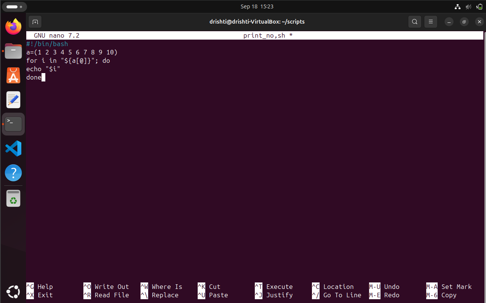
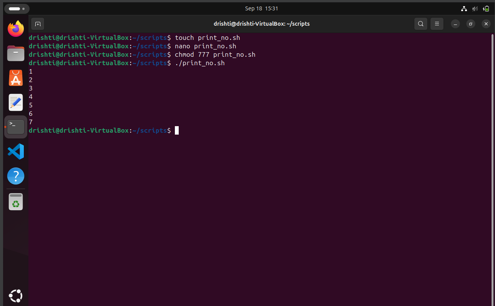

# 🔢 `print_no.sh` — Print Numbers from an Array 🧮🚀

A super simple and beginner-friendly **Bash script** that prints numbers stored in an array! 🎉  
Perfect for learning how loops and arrays work in shell scripting. 🐚

---

## 📜 Script Summary

This script defines an array of numbers and uses a `for` loop to print each one.  
It currently prints numbers from **1 to 7**, but you can easily change or extend the array!

---

## 👀 Preview

### 🧾 Script Contents:

```bash
#!/bin/bash
# Usage: ./print_no.sh

a=(1 2 3 4 5 6 7)

for i in "${a[@]}"; do
  echo "$i"
done
````
### VISUALIZATION:



---

## 🚀 How to Run

1. 💾 Save the script as `print_no.sh`
2. Make it executable:

```bash
chmod +x print_no.sh
```

3. Run it:

```bash
./print_no.sh
```

---

## 🔍 Sample Output

```
1
2
3
4
5
6
7
```

## VISUALIZATION:📷




---


## 🧠 How It Works

* `a=(1 2 3 4 5 6 7)` — Declares an array of numbers
* `for i in "${a[@]}"` — Loops through all elements in the array
* `echo "$i"` — Prints each number

---


