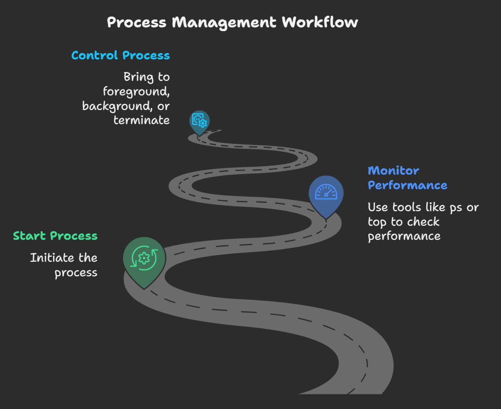
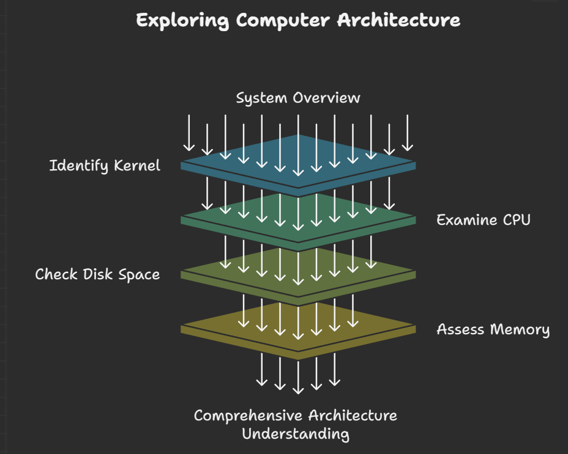
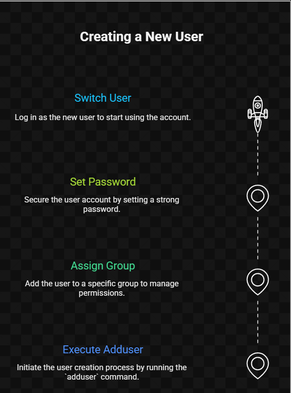

## 🚀 1️⃣ Introduction

Advanced commands are your *superpowers* — helping you manage processes, permissions, users, links, and system performance.  
Once you’re here, you’re beyond just “using” Linux — you’re **controlling** it 👑  

🧭 **Concept Flow:** 


[alt text](concept.png)


---

## 🧩 2️⃣ File Permissions & Ownership

| Command | Description | Example |
|----------|--------------|----------|
| `chmod` | Change file permissions | `chmod 755 script.sh` |
| `chown` | Change file ownership | `sudo chown drishti:users notes.txt` |
| `umask` | Default permission mask | `umask 022` |

📜 *Permission Table:*  
| Code | Meaning | Access |
|------|----------|---------|
| 7 | 4+2+1 | rwx |
| 6 | 4+2 | rw- |
| 5 | 4+1 | r-x |

💬 *Tip:* Check permissions with `ls -l` and decode it like a secret message 🕵️‍♀️  

---

## 🧠 3️⃣ Processes & Job Control

| 🔹 Command | 💬 Use |
|-------------|-------------|
| `ps` | Lists running processes |
| `top` / `htop` | Live process monitor |
| `kill PID` | Terminates process |
| `jobs` | Shows background jobs |
| `fg` / `bg` | Brings jobs to foreground/background |
| `nice` / `renice` | Adjusts process priority |

📈 **Flow Visualization:**  





**Q1.** 💭 What’s the difference between `&` and `nohup`?  
➡️ `&` runs process in background for current session.  
➡️ `nohup` keeps it alive even after logout.  

**Q2.** 🔫 What if a process freezes?  
➡️ Use `ps aux | grep process`, find PID → `kill -9 PID`  

💬 *Tip:* `Ctrl+Z` = suspend, `bg` = resume in background 🚀  

---

## 📊 4️⃣ System Information & Monitoring

| 🧰 Command | 🧩 Purpose |
|-------------|-------------|
| `uptime` | Shows how long system is running |
| `free -h` | Displays memory usage |
| `df -h` | Disk space overview |
| `du -sh` | Folder size summary |
| `uname -a` | Kernel & system info |
| `lscpu` | CPU details |
| `lsblk` | Lists storage devices |
| `who` | Logged-in users |

📜 *Visualization:*  




💡 *Pro Tip:* Combine with pipes for reports  
```bash
echo "System Report:" && uptime && df -h && free -h
````

---

## 🪄 5️⃣ Searching, Sorting & Filtering

**Q3.** 🔎 How to find text inside files?
➡️ `grep "pattern" filename`

```bash
grep -r "error" /var/log
```

**Q4.** 📁 How to locate commands & files?
➡️ `which`, `whereis`, `locate`

```bash
which python3
whereis ls
```

**Q5.** 📑 Sorting & Uniqueness:

```bash
sort file.txt
uniq file.txt
sort file.txt | uniq -c
```

🧩 *Flow:*


.png)


---

## 🔗 6️⃣ Links & Compression

| Command           | Purpose              | Example                        |
| ----------------- | -------------------- | ------------------------------ |
| `ln`              | Hard link            | `ln file1 file2`               |
| `ln -s`           | Soft (symbolic) link | `ln -s /path/file shortcut`    |
| `tar`             | Archive files        | `tar -cvf archive.tar folder/` |
| `gzip` / `gunzip` | Compress/uncompress  | `gzip data.txt`                |

📊 *Comparison Table:*

| Type | Works if original deleted? | Cross-filesystem? |
| ---- | -------------------------- | ----------------- |
| Hard | ❌ No                       | ❌ No              |
| Soft | ✅ Yes                      | ✅ Yes             |

💬 *Tip:* Use `ls -l` → soft links show with arrow ➡️ `shortcut -> original`

---

## 🧑‍💻 7️⃣ User & Group Management

| Command             | Action       |
| ------------------- | ------------ |
| `sudo adduser mahi` | Add user     |
| `sudo passwd mahi`  | Set password |
| `su - mahi`         | Switch user  |
| `groups`            | List groups  |
| `sudo userdel mahi` | Remove user  |

🧭 *Flow:*





💡 *Pro Tip:* `id username` shows UID, GID, and group membership

---

## 🧰 8️⃣ Package Management

**Q6.** 📦 How to install packages on Debian/Ubuntu?
➡️ `sudo apt install packagename`
**Q7.** 🔄 Update system packages:
➡️ `sudo apt update && sudo apt upgrade`

**Q8.** 🧩 Remove unused packages:
➡️ `sudo apt autoremove`

💬 *Tip:* On RHEL/CentOS, use `yum` or `dnf` instead of `apt`.

---

## 🧾 9️⃣ Disk & Directory Analysis

| Command            | Task                    | Example                     |
| ------------------ | ----------------------- | --------------------------- |
| `du -sh folder`    | Folder size             | `du -sh /home/drishti`      |
| `df -h`            | Disk space              | `df -h`                     |
| `lsblk`            | View disks & partitions | `lsblk`                     |
| `mount` / `umount` | Attach/detach disks     | `sudo mount /dev/sdb1 /mnt` |

💡 *Pro Tip:* `lsblk` = best visual summary of all drives 🔍

---

## 🧠 10️⃣ Mini Viva Practice

| ❓ Question                                | 💡 Hint                            |
| ----------------------------------------- | ---------------------------------- |
| How to view top memory-consuming process? | `top` or `ps aux --sort=-%mem`     |
| What’s the difference between PID & PPID? | Process ID vs Parent Process ID    |
| How do you kill all processes of a user?  | `pkill -u username`                |
| Difference between hard & soft links?     | Hard = same inode, Soft = shortcut |
| How to compress and extract tar file?     | `tar -cvf` / `tar -xvf`            |

---

## ✨ 11️⃣ Drishti’s Quick Recap Sheet 🧾

| Category    | Commands                                 |
| ----------- | ---------------------------------------- |
| Process     | `ps`, `top`, `kill`, `jobs`, `bg`, `fg`  |
| System Info | `uname`, `lscpu`, `lsblk`, `df`, `du`    |
| Search      | `grep`, `find`, `locate`, `sort`, `uniq` |
| Permissions | `chmod`, `chown`, `umask`                |
| Users       | `adduser`, `su`, `groups`                |
| Packages    | `apt install`, `apt update`              |

🧠 *Memory Trick:*

> **“PUFSP” → Process, Users, Files, Search, Packages” = advanced Linux five!” 💫

---

