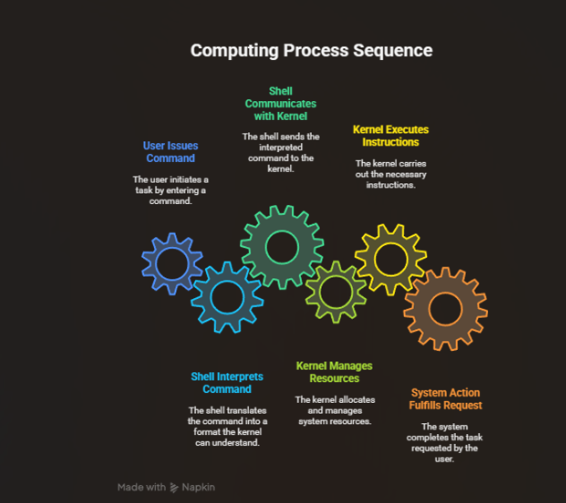

## 📘 1️⃣ Introduction

Linux basic commands are your foundation — everything else builds on these!  
They help you navigate, create, move, and inspect files from the terminal.  

🧭 **Core Idea:**  





---

## 🧩 2️⃣ File & Directory Navigation

| 🔹 Command | 💬 Purpose | ⚙️ Example |
|-------------|-------------|-------------|
| `pwd` | Prints working directory | `pwd` |
| `ls` | Lists files/folders | `ls -a` → show hidden ones |
| `cd` | Change directory | `cd /home/drishti` |
| `mkdir` | Make new folder | `mkdir projects` |
| `rmdir` | Remove empty folder | `rmdir old` |
| `rm -r` | Remove folder with files | `rm -r test` |
| `touch` | Create empty file | `touch notes.txt` |
| `cat` | Display file content | `cat file.txt` |

💬 **Tip:** Combine `cd` + `ls` = fastest way to navigate like a pro 🏃‍♀️

---

## 🧠 3️⃣ Viewing & Managing Files

**Q1.** 🔍 How to view file content without opening an editor?  
➡️ Use `cat`, `more`, or `less`.  
```

cat → small files
more → scroll line-by-line
less → scroll both ways

````

**Q2.** 🪄 How to create and write into a file?  
➡️ `cat > filename` → type content → press `Ctrl+D` to save.  

**Q3.** 📑 How to copy and move files?  
```bash
cp source.txt destination/
mv file.txt newname.txt
````

💡 *Tip:* Use `mv` for both moving **and renaming**!

---

## ⚙️ 4️⃣ Deleting & Searching

**Q4.** 🧹 How to delete files and directories safely?
➡️ `rm filename` (file)
➡️ `rm -r foldername` (directory)
⚠️ *Warning:* `rm -rf /` = system wipe ❌

**Q5.** 🔎 How to find a file anywhere in system?
➡️ `find / -name file.txt`
🧭 *Shortcut:* `locate file.txt` (if `mlocate` db is updated)

**Q6.** 🧾 How to search text inside files?
➡️ `grep "keyword" filename`
📊 *Flow:*

```
file → grep → filters → matched lines only
```

---

## 🧮 5️⃣ Counting & Summarizing

**Q7.** 📊 How to count lines, words, and characters?
➡️ `wc file.txt` or
➡️ `wc -l` (lines), `wc -w` (words), `wc -c` (chars)

**Q8.** 📦 How to check disk space & file size?

```bash
df -h   # shows disk usage
du -sh *   # size of each item in current folder
```

💬 *Tip:* Use human-readable flag `-h` for GB/MB view 👀

---

## 🧾 6️⃣ File Permissions Basics

| Symbol | Meaning | Value |
| :----- | :------ | :---: |
| r      | Read    |   4   |
| w      | Write   |   2   |
| x      | Execute |   1   |

**Q9.** 🔐 How to change permissions?
➡️ `chmod 755 file.sh`
Owner gets full, group/others get read+execute.

**Q10.** 👑 How to change ownership?
➡️ `sudo chown user:group file.txt`

📈 *Flow:*

```
chmod → changes mode
chown → changes owner
```

---

## 💡 7️⃣ Redirection & Pipes

**Q11.** 🚰 What’s the difference between `>` and `>>`?
➡️ `>` overwrites file.
➡️ `>>` appends content.

**Q12.** 🔗 How does piping `|` work?
➡️ Connects output of one command to another.

```bash
ls | grep "txt"
```

📊 *Visual:*

```
[ls output] → [grep filter] → [result]
```

**Q13.** 🧾 Redirect errors separately?
➡️ `command 2> error.log` (stderr only)
➡️ `command > out.log 2>&1` (stdout + stderr)

---

## ⚡ 8️⃣ Environment & System Info

| 🧰 Command | 🧩 Use                |
| ---------- | --------------------- |
| `whoami`   | Shows current user    |
| `hostname` | Shows system name     |
| `date`     | Displays date/time    |
| `cal`      | Shows calendar        |
| `history`  | Lists command history |
| `clear`    | Clears screen         |

💬 *Tip:* To re-run last command → press 🔁 `!!`
or search past ones using `Ctrl + R`

---

## ✨ 9️⃣ Drishti’s Quick Recap Sheet 🧾

| Category    | Must-Know Commands            |
| ----------- | ----------------------------- |
| Navigation  | `ls`, `cd`, `pwd`             |
| File Ops    | `cp`, `mv`, `rm`, `touch`     |
| View        | `cat`, `less`, `head`, `tail` |
| Permissions | `chmod`, `chown`              |
| Search      | `find`, `grep`                |
| System      | `df`, `du`, `whoami`          |

🧠 *Mini Memory Trick:*

> **LCP-GH** → `ls`, `cd`, `pwd`, `grep`, `history` – 5 daily heroes ⚔️

---

## 💬 10️⃣ Mini Viva Practice 🗣️

| ❓ Question                             | 💡 Short Hint                            |
| -------------------------------------- | ---------------------------------------- |
| How to list hidden files?              | `ls -a`                                  |
| Difference: relative vs absolute path? | `/home/drishti` vs `../folder`           |
| Combine two commands in one line?      | Use `;` or `&&`                          |
| How to repeat last command?            | `!!`                                     |
| What’s `$PATH`?                        | Env variable storing command search dirs |

---

> 🪶 *Final Note:*
> Mastering basics = mastering Linux.
> The terminal listens carefully — talk to it clearly 😄

✨ *— Drishti Sharma 💻*

```
