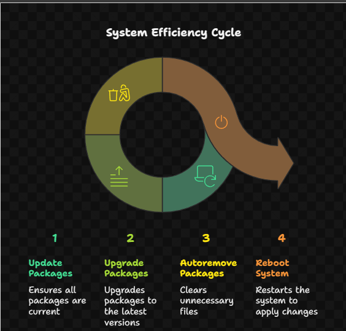

## 🚀 1️⃣ Introduction

Installing packages in Linux isn’t just about typing `sudo apt install` — it’s about understanding how your system fetches, verifies, and manages software.  
Think of it as a **smart warehouse system** — repositories store software, and your package manager is the delivery agent! 📦💻  

🧭 **Concept Flow:**  

```

Repository → Package Manager → System Database → Installation/Upgrade

```

---

## 🧰 2️⃣ Package Management Basics

| Command Type | Description | Example |
|---------------|-------------|----------|
| `apt` | Debian/Ubuntu-based manager | `sudo apt install vim` |
| `yum` / `dnf` | RHEL/Fedora-based manager | `sudo dnf install nano` |
| `snap` | Universal package format | `sudo snap install code --classic` |
| `flatpak` | Another universal manager | `flatpak install flathub org.gimp.GIMP` |

💬 *Tip:* Use `sudo apt update` before installing anything — it refreshes package lists. 🌀  

---

## 🧩 3️⃣ Repository Configuration

| Command | Purpose | Example |
|----------|----------|----------|
| `add-apt-repository` | Adds new software source | `sudo add-apt-repository ppa:graphics-drivers/ppa` |
| `apt update` | Refreshes repository index | `sudo apt update` |
| `apt-cache search` | Searches software in repo | `apt-cache search python` |

📦 *Repo Hierarchy:*  

```

/etc/apt/sources.list
└── /etc/apt/sources.list.d/

```

💡 *Pro Tip:* To manually add a repo → edit `/etc/apt/sources.list` using `sudo nano`.

---

## 🧱 4️⃣ Installing & Removing Packages

| Action | Command | Example |
|--------|----------|----------|
| Install | `sudo apt install pkg` | `sudo apt install git` |
| Remove | `sudo apt remove pkg` | `sudo apt remove firefox` |
| Purge (remove config too) | `sudo apt purge pkg` | `sudo apt purge nginx` |
| Reinstall | `sudo apt reinstall pkg` | `sudo apt reinstall curl` |
| Autoremove | `sudo apt autoremove` | Cleans unused dependencies |

💬 *Tip:* After multiple installs, run `sudo apt autoremove && sudo apt clean` to free space 🧹  

---

## 🧠 5️⃣ Update & Upgrade Cycle

| Command | Role |
|----------|------|
| `sudo apt update` | Refresh package database |
| `sudo apt upgrade` | Upgrade installed packages |
| `sudo apt full-upgrade` | Smart upgrade (handles dependencies) |
| `sudo apt dist-upgrade` | For older systems – similar to full-upgrade |

📈 *Flowchart:*  



💬 *Pro Tip:* Always run updates *before* installing new packages. It prevents dependency issues 🛠️  

---

## 🪄 6️⃣ Mounting & Installation Media

| Command | Action | Example |
|----------|--------|----------|
| `mount` | Mount devices/filesystems | `sudo mount /dev/sr0 /mnt` |
| `umount` | Unmount devices | `sudo umount /mnt` |
| `lsblk` | View available drives | `lsblk` |
| `df -h` | Check mount points | `df -h` |

💡 *Tip:* ISO files can be mounted like disks:  
```bash
sudo mount -o loop ubuntu.iso /mnt
````

Then you can explore or install from it 🎯

---

## 🧾 7️⃣ Environment Variables Setup

| Command            | Purpose                        | Example                                         |       |
| ------------------ | ------------------------------ | ----------------------------------------------- | ----- |
| `echo $PATH`       | View path variable             | Shows where system searches commands            |       |
| `export VAR=value` | Set temporary variable         | `export JAVA_HOME=/usr/lib/jvm/java-17-openjdk` |       |
| `printenv`         | List all environment variables | `printenv                                       | less` |
| `unset VAR`        | Remove variable                | `unset PATH_TEST`                               |       |

💬 *Tip:* Add exports permanently in `.bashrc` or `.bash_profile` for persistence 🔁

---

## 🧑‍💻 8️⃣ Snap & Flatpak — Modern Package Systems

| Manager        | Feature                             | Example                                      |
| -------------- | ----------------------------------- | -------------------------------------------- |
| `snap`         | Sandbox apps with dependencies      | `sudo snap install postman`                  |
| `flatpak`      | App containers for multiple distros | `flatpak install flathub com.spotify.Client` |
| `snap list`    | View installed snaps                | —                                            |
| `flatpak list` | View installed flatpaks             | —                                            |

⚙️ *Snap Storage:* `/var/lib/snapd/snaps`
⚙️ *Flatpak Storage:* `~/.local/share/flatpak`

💡 *Pro Tip:* Prefer Snap/Flatpak for GUI or newer app versions ✨

---

## ⚠️ 9️⃣ Troubleshooting Installation Issues

| Problem             | Possible Fix                                         |
| ------------------- | ---------------------------------------------------- |
| “Package not found” | Run `sudo apt update` or check repo source           |
| “Broken packages”   | `sudo apt --fix-broken install`                      |
| Dependency errors   | `sudo apt install -f`                                |
| Locked dpkg         | `sudo rm /var/lib/dpkg/lock-frontend` (with caution) |
| Disk space issues   | Clean cache → `sudo apt clean`                       |

💬 *Golden Rule:* Never force-remove system packages unless sure — it can break core OS! 🚫

---

## 🧠 10️⃣ Mini Viva Practice

| ❓ Question                                         | 💡 Hint                                                   |
| -------------------------------------------------- | --------------------------------------------------------- |
| What’s the difference between `apt` and `apt-get`? | `apt` is newer, user-friendly; `apt-get` is older backend |
| How do you add a new repository?                   | `sudo add-apt-repository`                                 |
| How to reinstall a package?                        | `sudo apt reinstall pkgname`                              |
| What’s `snap` used for?                            | Installing sandboxed universal apps                       |
| How to fix broken packages?                        | `sudo apt --fix-broken install`                           |
| How to check your PATH variable?                   | `echo $PATH`                                              |

---

## ✨ 11️⃣ Drishti’s Quick Recap Sheet 🧾

| Category     | Commands                                         |
| ------------ | ------------------------------------------------ |
| Install      | `apt install`, `snap install`, `flatpak install` |
| Update       | `apt update`, `apt upgrade`                      |
| Remove       | `apt remove`, `apt purge`, `autoremove`          |
| Repositories | `add-apt-repository`, `sources.list`             |
| Mounting     | `mount`, `umount`, `lsblk`, `df`                 |
| Env Vars     | `export`, `printenv`, `unset`                    |

🧠 *Memory Trick:*

> **“IMURE” → Install, Mount, Update, Repo, Env-vars** = Installation Master Flow ⚙️💫

---

