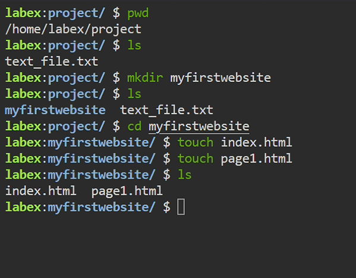

# VS Code Terminal: Basic File Navigation & Management Commands

Use these common shell commands directly in VS Code's integrated terminal (open with `Ctrl+`` on Windows/Linux or `⌃\`` on macOS).

---

## 1. `pwd` — Print Working Directory

Displays the full path of the directory you’re currently in.

```bash
$ pwd
/home/username/my-project
This helps you confirm your current location within the file system. 
DigitalOcean
Linuxize

2. ls — List Directory Contents
Lists files and folders in the current (or specified) directory.

bash
Copy
Edit
$ ls
README.md src/ docs/

$ ls -l
drwxr-xr-x 2 user user 4096 Jul 26 10:00 docs
-rw-r--r-- 1 user user  123 Jul 26 09:50 README.md
-rw-r--r-- 1 user user  456 Jul 26 09:55 src/
-l: Long format including permissions, owner, size, and date

-a: Show hidden files (those starting with .) 
Gravity DevOps
Linuxize
Red Hat

3. cd — Change Directory
Navigate between directories.

bash
Copy
Edit
$ cd src
$ pwd
/home/username/my-project/src

$ cd ..
$ pwd
/home/username/my-project