 

````md
# 🖥️ Intermediate & Advanced Linux Terminal Commands  

Welcome to the **next level** of Linux command-line mastery 🚀.  
This guide covers **system management**, **permissions**, **monitoring**, and **networking** commands every power user should know.  

---

## 🔑 `sudo` – Run Commands as Superuser  
`sudo` lets you run commands with **administrator privileges**.  
```bash
# Update system packages
sudo apt update && sudo apt upgrade
````
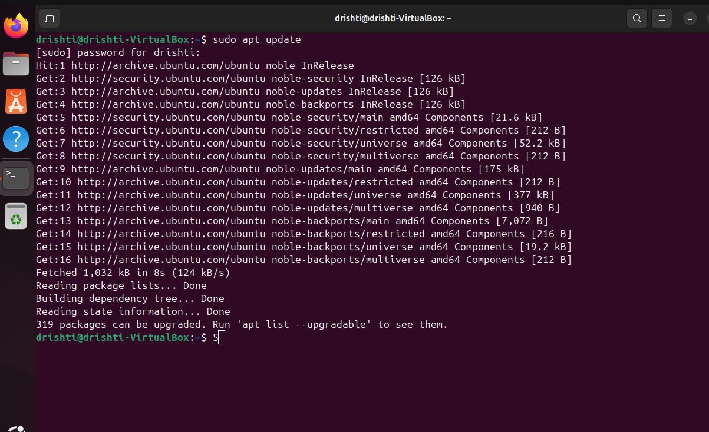
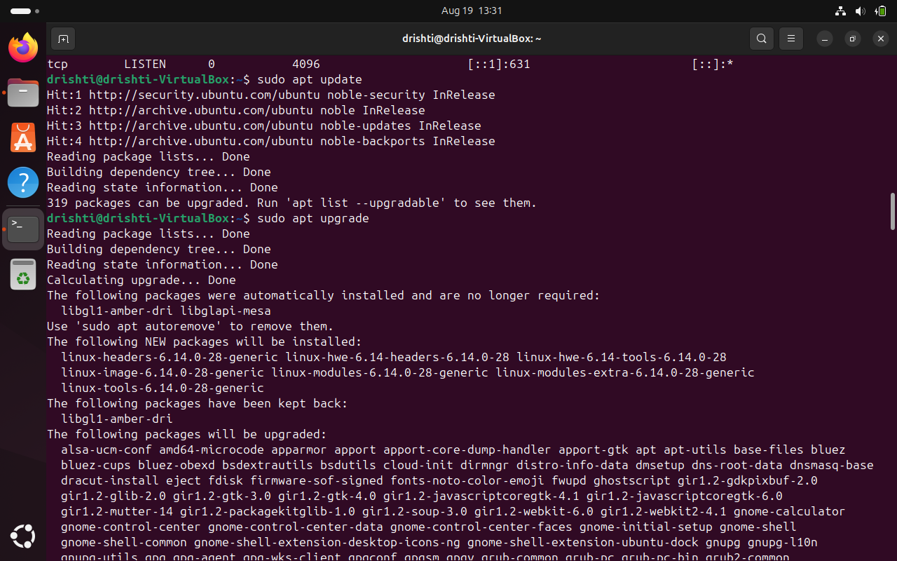
> ⚠️ **Warning:** Use `sudo` carefully—mistakes can break the system.

---

## 👥 User Management

Linux is a **multi-user system**. Manage users like a pro:

| Command   | Description                 | Example                         |
| --------- | --------------------------- | ------------------------------- |
| `whoami`  | Show current logged-in user | `whoami`                        |
| `id`      | Show user & group IDs       | `id username`                   |
| `adduser` | Create a new user           | `sudo adduser drishti`          |
| `usermod` | Modify user properties      | `sudo usermod -aG sudo drishti` |
| `deluser` | Remove a user               | `sudo deluser drishti`          |


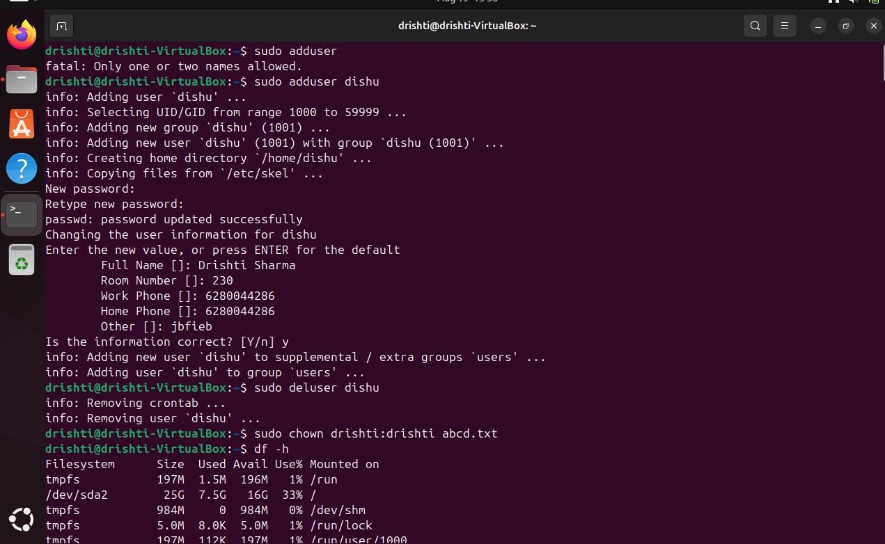

---


## 🔒 File Permissions: `chmod` & `chown`

### `chmod` – Change File Permissions

```bash
# Give read/write/execute permissions to the owner
chmod u+rwx file.txt

# Remove write permission for group
chmod g-w file.txt
```

|     ' User'     |    'Group'      |    'Others'   |
|     0 or 4      |   0 or 2        |    0 or 1     |  

chmod g-group
      o-others
      s-user

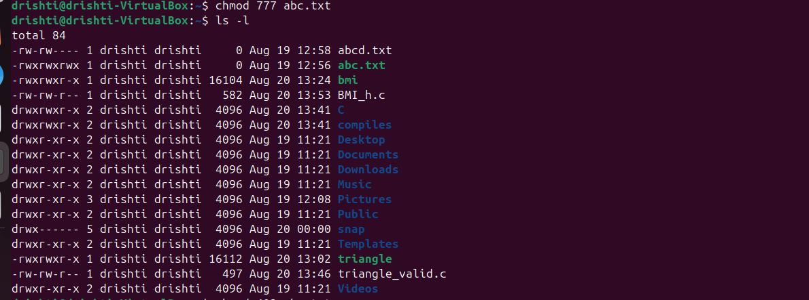
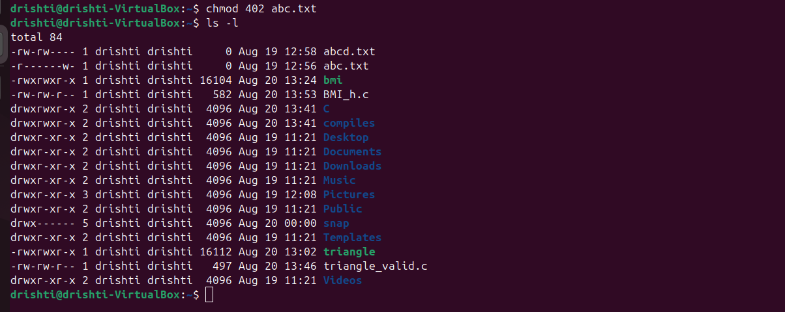

### `chown` – Change File Ownership

```bash
# Make "drishti" the owner of file.txt
sudo chown drishti file.txt

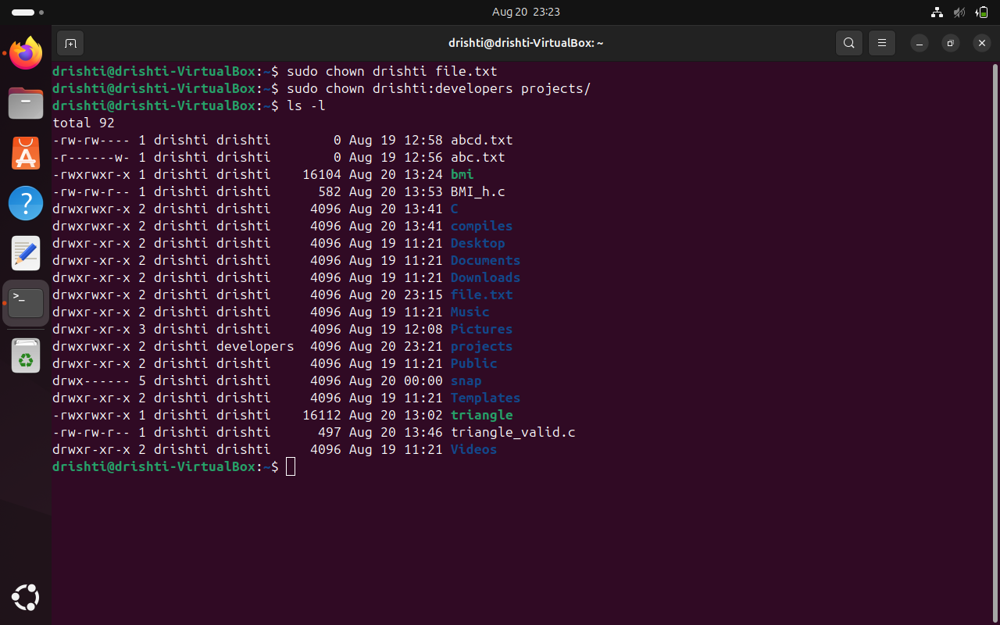

# Change owner and group
sudo chown drishti:developers project/
```

> 💡 

---

## 💾 Disk Usage: `df` & `du`

### `df` – Disk Free


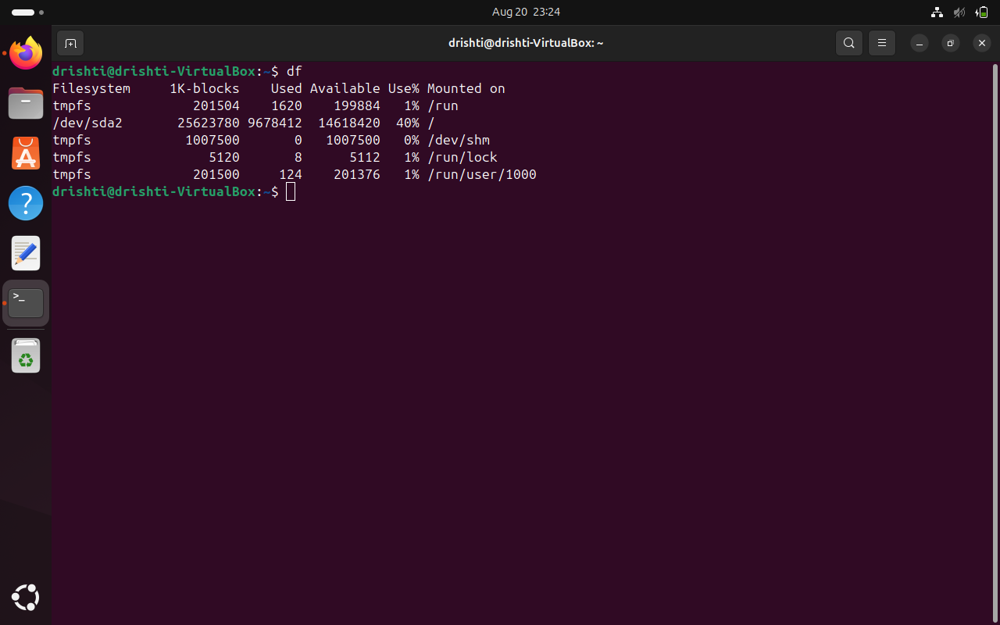

Check **disk space usage** of mounted filesystems:

```bash
df -h
```

* `-h` → human-readable sizes (GB, MB).

### `du` – Disk Usage

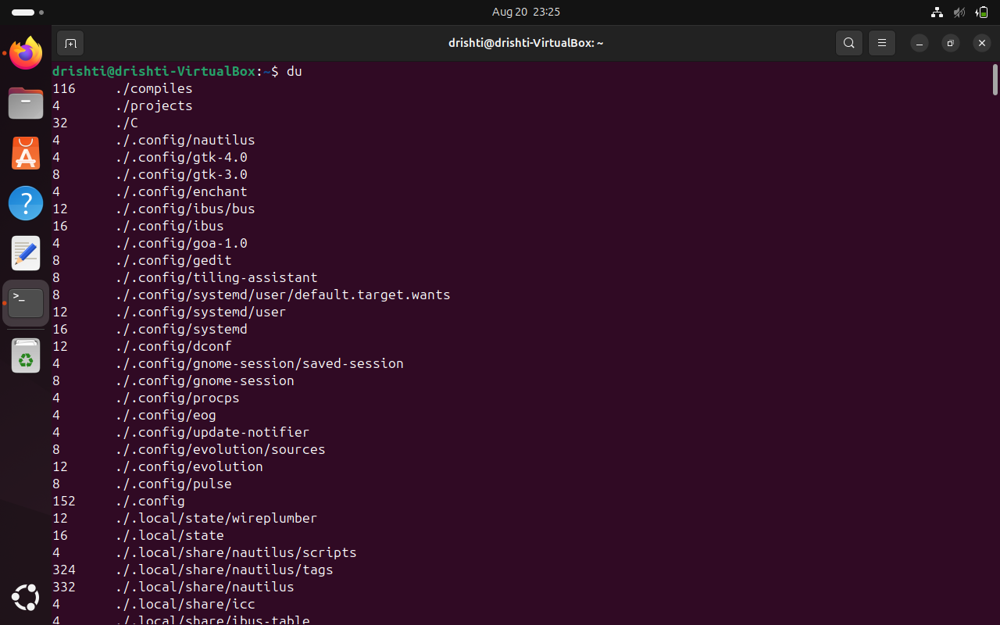

Check **space taken by directories/files**:

```bash
du -sh *


```

* `-s` → summary
* `-h` → human-readable


---

## 📊 Process Monitoring: `top`

`top` shows real-time **system processes** and resource usage.

```bash
top
```

* `q` → quit
* `k` → kill a process by PID
* `M` → sort by memory usage
* `P` → sort by CPU usage

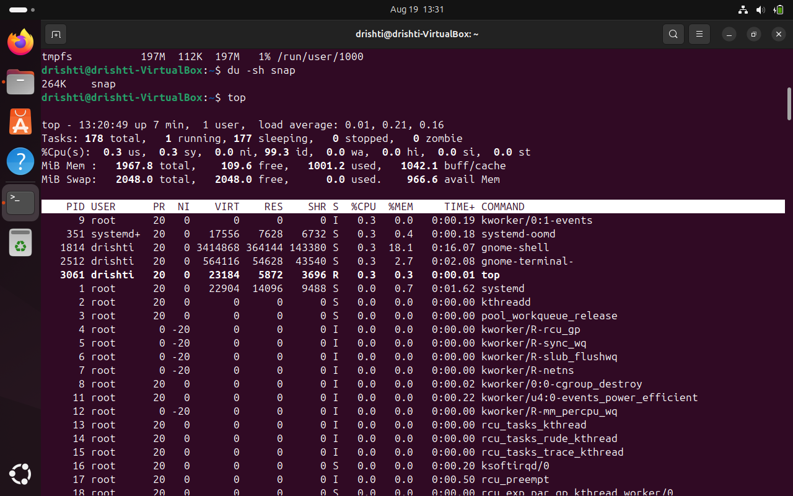

---

## 🌐 Networking: `ping` & `ss`

### `ping` – Test Network Connectivity

```bash
ping google.com
```

* Useful for checking if a host is reachable.
* `Ctrl + C` → stop ping.

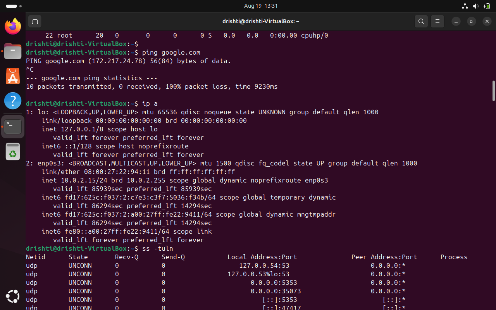

### `ss` – Socket Statistics (Modern replacement for `netstat`)

```bash
# Show all listening ports
ss -tuln

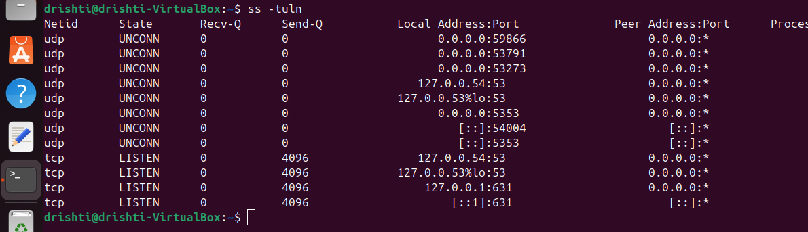

# Show established connections
ss -tn state established


```

---

## 📦 Package Management

Manage software installations depending on your Linux distro:

### For **Ubuntu/Debian (APT)**:

```bash
sudo apt update            # Refresh package list
sudo apt upgrade           # Upgrade installed packages
sudo apt install git       # Install a package
sudo apt remove git        # Uninstall a package
```


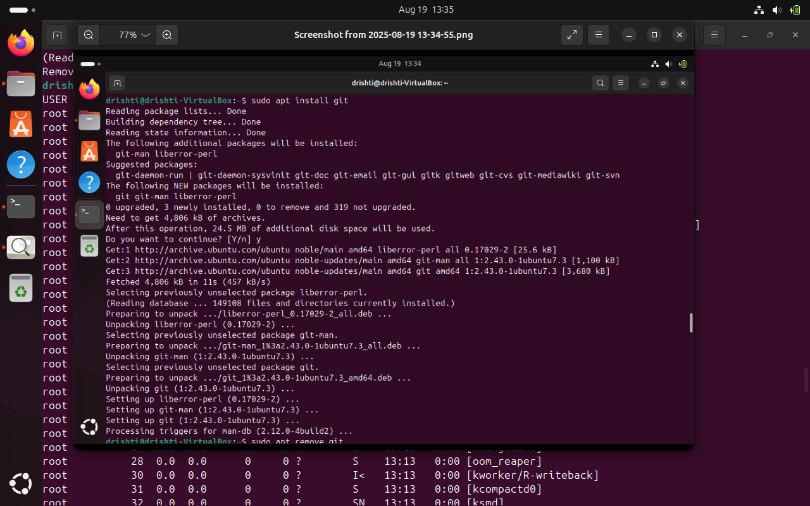

---


