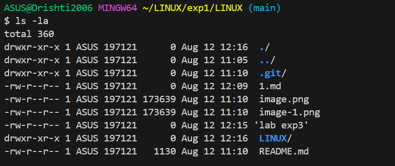

# basic linux command

>>pwd

output examples:
'''
C:\Users\ASUS\LINUX\exp1\LINUX
'''
# ls command

The ls command in linux allow to veiw all the files and currently working directory.

 Directory: C:\Users\ASUS\LINUX\exp1\LINUX

Mode                 LastWriteTime         Length Name
----                 -------------         ------ ----

d-----         8/12/2025  12:16 PM                LINUX

-a----         8/12/2025  12:09 PM              0 1.md

-a----         8/12/2025  11:10 AM         173639 image-1.png

-a----         8/12/2025  11:10 AM         173639 image.png

-a----         8/12/2025  12:15 PM              0 lab exp3

-a----         8/12/2025  11:10 AM           1130 README.md

# Image Snap Shots

