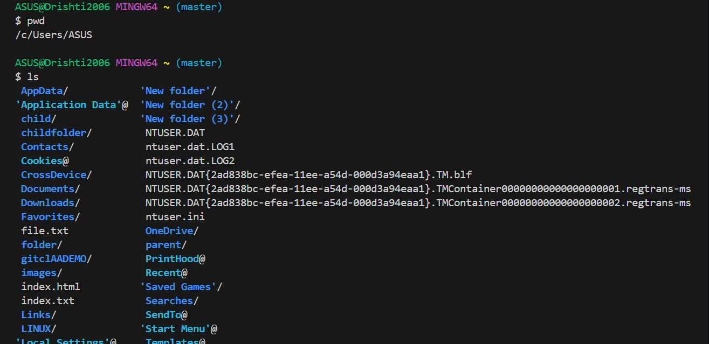
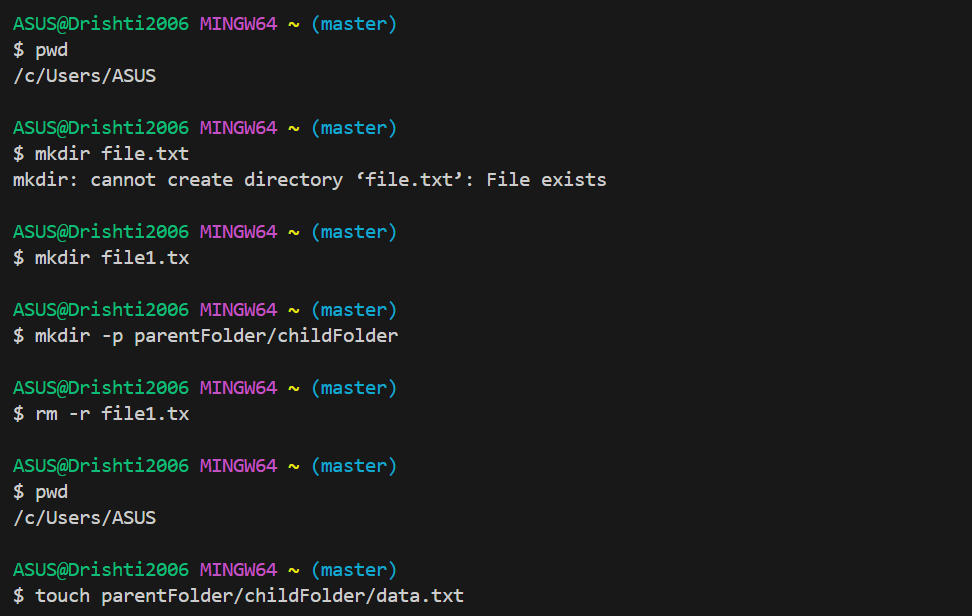
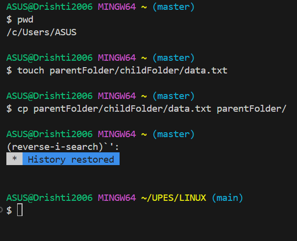

1️⃣ we entered **pwd** to check the directory in which we are and then listed through ls command.
                                📷    
                                
📍This experment exists of snapshots in which we have firstly created a parent folder .

2️⃣ Then in parent folder📂 we created a child folder📁.
                                📷    
                                
3️⃣ we made a txtfile🗄️in child folder📁.
                                📷     
                                
4️⃣ we copied the txtfile 🗄️ from child folder📁 to parent folder📂.
