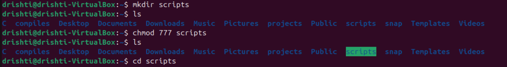
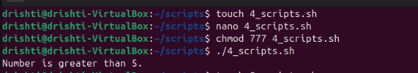
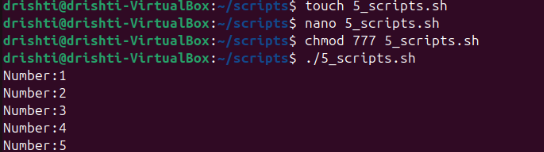
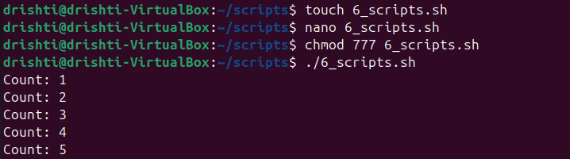
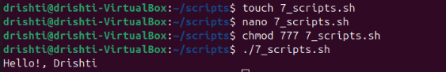
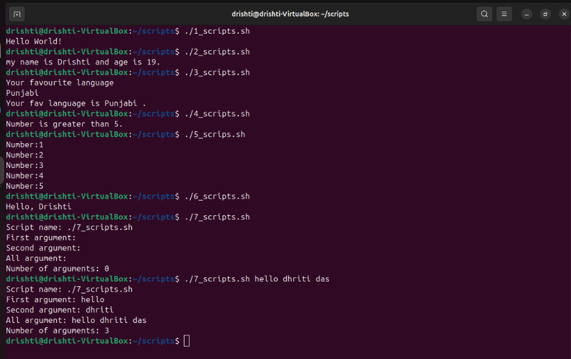
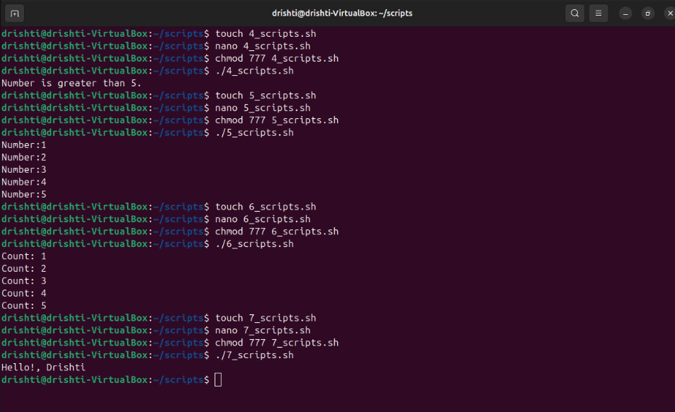

# 🐚 Basics of Shell Scripting

Shell scripting is a way to automate tasks in Linux/Unix using a series of commands written in a file (script).  
In this guide, we’ll cover **basic shell scripting concepts** with examples you can try in **VS Code**.

---
### IMPORTANT ###


📍Before starting the commands , we will make a directory named "scripts" in which we will make these command work.

```bash
mkdir scripts
ls -l
chmod 777 scripts
ls -l
cd scripts
```
After this we will make different text files in it.

* chmod 777 scripts will highlight scripts in green colour.

### PICTORIAL REPRESENTATION 📷




## 1. 📌 Creating a Shell Script
A shell script is just a text file with commands. By convention, scripts use the `.sh` extension.

```bash
#!/bin/bash
# This is a simple script
echo "Hello, World!"
````


* `#!/bin/bash` → Shebang, tells the system to use the Bash shell.
* `echo` → Prints text.

### PICTORIAL REPRESENTATION 📷


## 2. 📌 Variables

Variables store data in shell scripts.

```bash
#!/bin/bash
name="Drishti"
age="19"
echo "My name is $name and age is $age."
```

* No spaces around `=`.
* Use `$variable` to access values.

---

### PICTORIAL REPRESENTATION📷


## 3. 📌 Taking User Input

```bash
#!/bin/bash
echo "Enter your fav language:"
read lang
echo "Your fav language is $lang"
```

* `read` → takes input from user.

---

### PICTORIAL REPRESENTATION 📷


## 4. 📌 Conditional Statements

```bash
#!/bin/bash
num=15
read num

if [ $num -gt 5 ]; then
    echo "Number is greater than 5"
else
    echo "Number is less than 5"
fi
```

* `[ condition ]` → test expression.
* `-gt` means "greater than".

---

### PICTORIAL REPRESENTATION 📷



## 5. 📌 Loops

### For Loop

```bash
#!/bin/bash
for i in 1 2 3 4 5
do
    echo "Number: $i"
done
```

### PICTORIAL REPRESENTATION 📷



### While Loop

```bash
#!/bin/bash
```bash
count=1
while [ $count -le 5 ]
do
    echo "Count: $count"
    ((count++))   # increment
done
```

---

### PICTORIAL REPRESENTATION 📷




## 6. 📌 Functions

```bash
#!/bin/bash
greet() {
    echo "Hello, $1!"
}

greet "Drishti"
```

* `$1` → first argument to function.

---

### PICTORIAL REPRESENTATION 📷



## 7. 📌 Command-Line Arguments

```bash
#!/bin/bash
echo "Script Name: $0"
echo "First Argument: $1"
echo "Second Argument: $2"
echo "All arguments: $@"
echo "Numbers of arguments: $#"
```


---

### PICTORIAL REPRESENTATION 📷


## 8. 📌 Operators:

* `-eq` (equal)
* `-ne` (not equal)
* `-gt` (greater than)
* `-lt` (less than)
* `-ge` (greater or equal)
* `-le` (less or equal)

### ALL COMMAND OUTPUTS IN ONE WAY:


## PICTORIAL REPRESENTATION 📷




